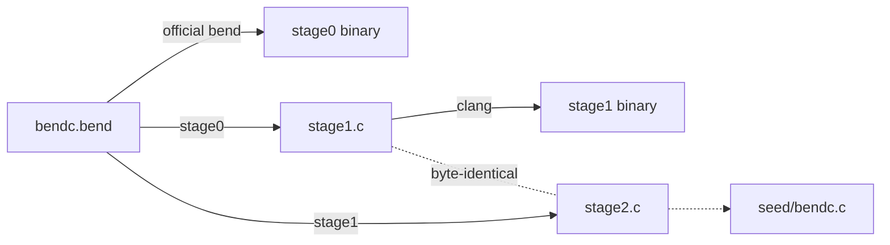

<h1 align="center">bendc</h1>

<p align="center">
  <b>A self-hosting compiler for <a href="https://bend-lang.com">Bend 2</a>, written in Bend 2.</b><br>
  Bend in, C out. The compiler compiles itself, and the output reproduces itself byte for byte.
</p>

<p align="center">
  <a href="https://github.com/Lulzx/bendc/actions/workflows/ci.yml"></a>
  
  
  <a href="LICENSE"></a>
</p>

---

```
$ ./bootstrap.sh
[stage0] bend bendc.bend -o build/bendc0          # the official Bend builds bendc once
[stage1] bendc0 -> build/stage1.c                 # bendc compiles itself
[stage2] stage1 -> build/stage2.c                 # the result compiles itself again
fixpoint: stage1.c == stage2.c (9432 lines)
tests with bendc0: 16 passed, 0 failed
tests with stage1: 16 passed, 0 failed
tests with stage2: 16 passed, 0 failed
```

`bendc.bend` is one file of Bend (about 4,600 lines, 470 definitions). Its source passes
`bend --check-only`, so the official checker accepts it. It lexes, parses, erases, and code-generates
Bend programs, including the parts of Bend's standard library (`Base`) that a program uses. The result
is a single C file that clang builds against a small runtime (`rt/bendrt.h`).

## Contents

- [Quick start](#quick-start)
- [What it looks like](#what-it-looks-like)
- [Bootstrapping](#bootstrapping)
- [Language support](#language-support)
- [How it works](#how-it-works)
- [Writing a compiler under Bend's rules](#writing-a-compiler-under-bends-rules)
- [Testing](#testing)
- [Limitations](#limitations)
- [Repository layout](#repository-layout)

## Quick start

You need a C compiler (clang) and a [Bend install](https://bend-lang.com), which provides `base.bend`:

```sh
curl -fsSL https://bend-lang.com/install.sh | sh    # the official Bend (provides ~/.bend/bend2/base.bend)

git clone https://github.com/Lulzx/bendc && cd bendc
make                  # builds build/bendc from the committed C seed, in about 2 seconds
make test             # compiles and runs every program in tests/, comparing with the official bend
```

Compile a program:

```sh
./build/bendc ~/.bend/bend2/base.bend hello.bend > hello.c
clang -O2 -I rt hello.c -o hello -lm && ./hello
```

Debugging aids: `bendc --tokens file.bend` prints the token stream after layout, and
`bendc --ast file.bend` prints the parsed declarations.

## What it looks like

A Bend program:

```python
import Base

type Shape is Data:
  Circle{r: U32}
  Square{s: U32}

def area(x: Shape) -> U32:
  match x:
    case Circle{+r}:
      (3 * r * r : U32)
    case Square{+s}:
      (s * s : U32)

def sum(xs: List<U32>, acc: U32) -> U32:
  match xs:
    case Nil{}:
      acc
    case Con{h, t}:
      sum(t, (acc + h : U32))

def adder(k: U32) -> U32 -> U32:
  x => (x + k : U32)
```

The C that `bendc` generates for it, unedited:

```c
static V F_area(V a0) {
top:;
V s0 = a0;
if (TAG(s0) == 0) {
return F_U32_dmul(F_U32_dmul(3u, FLD(s0, 0)), FLD(s0, 0));
} else if (TAG(s0) == 1) {
return F_U32_dmul(FLD(s0, 0), FLD(s0, 0));
} else { bend_fail("incomplete match"); }
}

static V F_sum(V a0, V a1) {               // the tail call becomes a loop
top:;
V s33 = a0;
if ((s33) == IMM(0)) {
return a1;
} else if (TAG(s33) == 1) {
{ V t0 = FLD(s33, 1); V t1 = F_U32_dadd(a1, FLD(s33, 0)); a0 = t0; a1 = t1; goto top; }
} else { bend_fail("incomplete match"); }
}

static V F_adder(V a0) {                   // lambdas are lifted into closures
top:;
return mk_clo(L35, 2, 1, (V[]){a0});
}
```

A `main` that returns a value, rather than `IO`, is evaluated, and the value is printed in Bend
syntax. This matches the official tool:

```python
def main() -> List<&2, Tree<String>> & Maybe<&2, Box> & Nat & Char & String & Bool:
  ([Node{Leaf{}, "a\n\"b\"", Node{Leaf{}, "c", Leaf{}}}, Leaf{}], Some{Box{3.0}}, 42n, '\'', "tab\there", True{})
```
```
([Node{Leaf{}, "a\n\"b\"", Node{Leaf{}, "c", Leaf{}}}, Leaf{}], Some{Box{3.0}}, 42n, '\'', "tab\there", True{})
```

## Bootstrapping



- **`make bootstrap`** does the full chain. The official `bend` builds stage0 from `bendc.bend`.
  Stage0 compiles `bendc.bend` into `stage1.c`, and stage1 compiles it again into `stage2.c`. The two
  C files must be identical, and all three compilers must pass the test suite.
- **`seed/bendc.c`** is the committed fixpoint, the way self-hosting compilers usually ship a seed.
  Building `bendc` needs only a C compiler. `make selfcheck` verifies that the current `bendc.bend`
  still compiles to exactly this seed, and `make seed` regenerates it after the compiler changes.

CI runs the whole chain on Linux and macOS: seed build, tests, selfcheck, and full bootstrap.

## Language support

| Area | Supported |
|---|---|
| Declarations | `type` (with type parameters, `is Data` / `is Type`), `def`, `law`, `@unsafe`, `import Base`, `import ./file.bend as M` |
| Proofs | laws and proofs are accepted and erased at runtime: `{==}`, `{a == b : T}`, `%e : P` rewrites, `?holes`, dependent types |
| Patterns | several scrutinees at once; nested constructors; `h <> t`; tuples; `0n` / `1n+p`; char, number and **string** literals; `_`; `+x` |
| Bindings | `x = v`, `+x = v`, `-x = v`, `(a, b) = v`, `K{..} = v`, parallel lets `a b = f(x) g(y)` |
| Functions | closures, currying and partial application, templates (`~f`), `f!(x)` calls, and tail calls compiled to loops |
| Monads | `do M<..>:` for any monad (`IO`, `Maybe`, `Result`, your own), `x : T <- m`, `return` |
| Operators | `(a + b : T)` typed arithmetic, bitwise and comparison operators, `&&` `\|\|` `++` `<>` |
| Data | `U32`, `Nat`, `F32`, `Char`, `String`, lists, tuples, `Map`, `Set`, arrays (`[v : T*n]`, `a[i]`, `a[i] <- v`) |
| Effects | `IO.print`/`write`/`print_err`, `IO.args`, `IO.get_env`, files, `IO.now`/`sleep`/`random_u32`, `IO.fork`/`IO.join` and channels, `IO.die` exit codes |
| Output | an `IO` main runs its effects; any other main prints its value in Bend syntax |

## How it works

```
source ─► lexer ─► layout ─► parser ─► operator  ─► tables & ─► codegen ─► C file ─► clang ─► binary
          chars    INDENT/   (parser    resolution   erasure     (state          +
          →tokens  DEDENT    monad)                              monad)       rt/bendrt.h
```

1. **Lexer and layout.** Characters become tokens, and indentation becomes `NEWLINE`/`INDENT`/`DEDENT`.
   A deeper line opens a block only after a `:`. Otherwise it continues the previous line, and so
   does a line after one that ends in an operator. Newlines inside brackets are ignored.
2. **Parser.** Recursive descent, written with a parser monad `Toks -> A & Toks` and Bend's own
   `do`-notation. Statements fold into `let`/`match`/bind expressions, and `do` blocks desugar into
   `M.bind`/`M.pure` calls. Types are terms in Bend, so they parse with the expression grammar;
   `List<a, A>` is recognised by the missing space before `<`, and `>>` is split when it closes one.
3. **Operator resolution.** `(a + b : T)` becomes `T.add(a, b)`, with the type taken from the nearest
   annotation. Unannotated operators belong to `Nat`.
4. **Tables and erasure.** Every constructor gets a tag, an arity and a representation. Every def gets
   a mask of its runtime parameters. Erased parameters (`-x`, bare quantity parameters, and
   `Type`/`Data`/`Kind`-typed ones) are dropped at each known call site. Parameters of a def that
   fills a `law` take their modes from the law.
5. **Code generation.** A state monad threads fresh names, emitted C, references and errors through
   the generator. Only defs reachable from `main` are emitted.
   - Each def becomes a C function, and self tail calls become `goto` loops.
   - Lambdas are lambda-lifted using free-variable analysis.
   - A call with every argument goes direct; with fewer it builds a partial closure; with more it
     goes through `apply`.
   - A match becomes a first-match `if` chain over tags. A `match` or `let` in expression position
     uses a GNU statement expression.
6. **Value printers.** For a non-`IO` main, printers are generated from main's return type and the
   field types of each constructor, specialised per type instance (e.g. `Tree<String>`).

**Runtime** (`rt/bendrt.h`, about 520 lines). Every value is one 64-bit word:

| Value | Representation |
|---|---|
| `U32`, `Char`, `F32`, `Nat` | the raw number (`F32` as IEEE bits, `Nat` as u64) |
| nullary constructor (`Nil{}`, `True{}`) | `(tag << 3) \| 1` |
| constructor with fields | pointer to `{tag, fields...}` |
| one constructor with one field (`Chr{code}`) | the field itself |
| closure | pointer to `{fn, arity, nargs, args...}` |

Base implements `U32` as a 32-bit vector of `Bool`s, which proofs can reason about. `bendc` replaces
those defs, and the `Nat`/`F32` primitives, with native C. Memory is a bump arena. The program runs
on a thread with a 4 GB stack, so deep non-tail recursion is fine: a million-deep recursive list
builds and folds in about 0.1s, where the official runtime overflows its stack at 100,000. IO
follows Base's continuation-passing `IO` type, with effects as native C functions.

## Writing a compiler under Bend's rules

Bend 2 is a proof language, and its checker is strict about code that runs. It shaped this compiler:

- **Define before use, no mutual recursion.** A parser is mutually recursive by nature. Bend allows
  forward declaration through a `law` (a typed claim) that a later `def` fills, and that def must be
  `@unsafe` if it doesn't provably terminate. `tools/order.py` automates this. It topologically
  sorts the file into sections, finds each strongly connected component, and turns one def per cycle
  into a `law` plus a filling `def`.
- **`match` only on parameters.** A match cannot inspect a computed value, and neither can
  destructuring. So each decision is a small helper def whose parameter is the thing being matched.
  The parser monad avoids most of the tuple-destructuring helpers a hand-threaded token list would
  need.
- **Affine variables.** A variable is used at most once unless it is marked `+`, which requires a
  copyable `Data` type. Every AST type is `Data`, and `+` appears where values are reused.
- **Totality.** A recursive call must shrink its first changing argument. The compiler's recursion
  over tokens isn't structural, so those defs are `@unsafe`.

The compiler compiles every one of these patterns in its own source. It handles its own laws, its
own `@unsafe` defs, and its own user-defined monads (`Parser`, `Gen`), which is what makes the
fixpoint meaningful.

## Testing

`tests/` holds 16 programs covering the features above: closures, trees, maps, sorting, strings and
UTF-8, file IO, fork/join, modules, string patterns, arrays, proofs, value printing, exit codes, and
deep recursion. Each `.out` file is the stdout and exit code of the **official** `bend` running the
same program. `run_tests.sh` compiles each program with a given `bendc`, runs it, and diffs the
result.

```sh
make test                      # with build/bendc
./run_tests.sh build/stage1    # with any stage
```

## Limitations

- **No type checking.** `bendc` erases types and trusts its input, so run `bend --check-only` for
  diagnostics. Errors `bendc` does report: parse errors with line numbers, unknown names, and
  unknown constructors.
- **No GPU.** `f!(x)` runs sequentially; `IO.fork` runs the forked computation to completion
  immediately.
- `Nat` is a 64-bit integer. Memory is never freed.
- No hub imports (`import 0x…`), no user-defined foreign effects, and no windowing or audio effects.
- A function value inside a printed non-`IO` result shows as `<function>`.

## Repository layout

| Path | |
|---|---|
| [`bendc.bend`](bendc.bend) | the compiler, organized by section: lexer, layout, parser monad, expressions, patterns, statements, declarations, operator resolution, free variables, global tables, code generation, value printers, modules, driver |
| [`rt/bendrt.h`](rt/bendrt.h) | C runtime: heap, closures, strings, native `U32`/`Nat`/`F32`, IO effects, entry points |
| [`seed/bendc.c`](seed/bendc.c) | the fixpoint C output of `bendc.bend`, for building without Bend |
| [`tests/`](tests) | test programs and the official `bend`'s output for each |
| [`bootstrap.sh`](bootstrap.sh), [`run_tests.sh`](run_tests.sh), [`Makefile`](Makefile) | bootstrap and fixpoint check, test runner, build entry points |
| [`tools/order.py`](tools/order.py) | dev tool: section-aware dependency sort, with automatic `law` forward declarations for cycles |

## License

[MIT](LICENSE)
