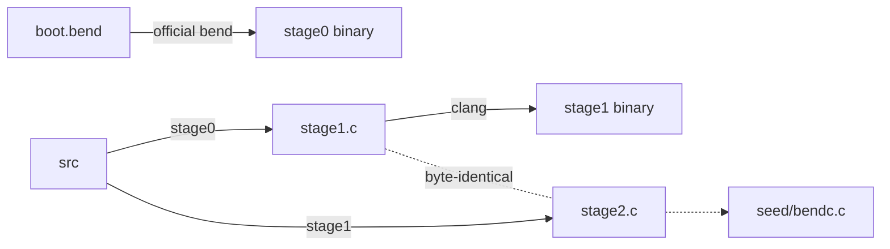

<h1 align="center">bendc</h1>

<p align="center">
  <b>A self-hosting compiler for <a href="https://bend-lang.com">Bend 2</a>, written in Bend 2.</b><br>
  Bend in, C out. The compiler compiles itself, and the output reproduces itself byte for byte.
</p>

<p align="center">
  <a href="https://github.com/Lulzx/bendc/actions/workflows/ci.yml"></a>
  
  
  <a href="LICENSE"></a>
</p>

---

```
$ ./bootstrap.sh
[stage0] bend boot.bend -o build/bendc0           # the official Bend builds bendc once
[stage1] bendc0 -> build/stage1.c                 # bendc compiles itself
[stage2] stage1 -> build/stage2.c                 # the result compiles itself again
fixpoint: stage1.c == stage2.c (35574 lines)
tests with stage1: 78 passed, 0 failed
tests with stage2: 78 passed, 0 failed
```

`bendc.bend` (the compiler) and `check.bend` (the type checker) are Bend: about 12,000 lines that
pass `bend --check-only`. bendc type-checks a program the way the official checker does (a port of
it, with the same error reports), then lexes, parses, erases, and code-generates it, including the
parts of Bend's standard library (`Base`) that the program uses. The result is a single C file that
clang builds against the runtime (`rt/bendrt.h`): a garbage collector, unbounded `Nat`, a
work-stealing pool for parallel calls, an event loop that speaks the official effect ABI, and a GPU
backend that runs `f!(x)` calls on Metal.

## Contents

- [Quick start](#quick-start)
- [What it looks like](#what-it-looks-like)
- [Bootstrapping](#bootstrapping)
- [Language support](#language-support)
- [How it works](#how-it-works)
- [The GPU backend](#the-gpu-backend)
- [Benchmarks](#benchmarks)
- [Writing a compiler under Bend's rules](#writing-a-compiler-under-bends-rules)
- [Testing](#testing)
- [Limitations](#limitations)
- [Repository layout](#repository-layout)

## Quick start

You need a C compiler (clang) and a [Bend install](https://bend-lang.com), which provides `base.bend`:

```sh
curl -fsSL https://bend-lang.com/install.sh | sh    # the official Bend (provides ~/.bend/bend2/base.bend)

git clone https://github.com/Lulzx/bendc && cd bendc
make                  # builds build/bendc from the committed C seed, in about 2 seconds
make test             # compiles and runs every program in tests/, comparing with the official bend
```

Compile a program:

```sh
./build/bendc ~/.bend/bend2/base.bend hello.bend > hello.c
clang -O2 -I rt hello.c -o hello -lm && ./hello
```

`bendc --js <base.bend> file.bend > file.js` emits JavaScript instead (run it with `bun file.js`; see
[The JavaScript target](#the-javascript-target)). `bendc --check-only <base.bend> file.bend` only type-checks, printing what `bend --check-only` prints.
`bendc --no-check ...` compiles without checking. Debugging aids: `bendc --tokens file.bend` prints the
token stream after layout, and `bendc --ast file.bend` prints the parsed declarations.

A compiled program takes the official runtime's options: `--threads N` (default: the CPU count),
`--gpu on|off|SIZE` (`off` runs `f!(x)` calls on the CPU threads), `--help`, and `--` before
the program's own arguments.

## What it looks like

A Bend program:

```python
import Base

type Shape is Data:
  Circle{r: U32}
  Square{s: U32}

def area(x: Shape) -> U32:
  match x:
    case Circle{+r}:
      (3 * r * r : U32)
    case Square{+s}:
      (s * s : U32)

def sum(xs: List<U32>, acc: U32) -> U32:
  match xs:
    case Nil{}:
      acc
    case Con{h, t}:
      sum(t, (acc + h : U32))

def adder(k: U32) -> U32 -> U32:
  x => (x + k : U32)
```

The C that `bendc` generates for it, unedited:

```c
static V F_area(V a0) {
top:;
V s0 = a0;
if (TAG(s0) == 0) {
return F_U32_dmul(F_U32_dmul(3u, FLD(s0, 0)), FLD(s0, 0));
} else if (TAG(s0) == 1) {
return F_U32_dmul(FLD(s0, 0), FLD(s0, 0));
} else { bend_fail("incomplete match"); }
}

static V F_sum(V a0, V a1) {               // the tail call becomes a loop
top:;
V s33 = a0;
if ((s33) == IMM(0)) {
return a1;
} else if (TAG(s33) == 1) {
{ V t0 = FLD(s33, 1); V t1 = F_U32_dadd(a1, FLD(s33, 0)); a0 = t0; a1 = t1; goto top; }
} else { bend_fail("incomplete match"); }
}

static V F_adder(V a0) {                   // lambdas are lifted into closures
top:;
return mk_clo(L35, 2, 1, (V[]){a0});
}
```

A `main` that returns a value, rather than `IO`, is evaluated, and the value is printed in Bend
syntax. This matches the official tool:

```python
def main() -> List<&2, Tree<String>> & Maybe<&2, Box> & Nat & Char & String & Bool:
  ([Node{Leaf{}, "a\n\"b\"", Node{Leaf{}, "c", Leaf{}}}, Leaf{}], Some{Box{3.0}}, 42n, '\'', "tab\there", True{})
```
```
([Node{Leaf{}, "a\n\"b\"", Node{Leaf{}, "c", Leaf{}}}, Leaf{}], Some{Box{3.0}}, 42n, '\'', "tab\there", True{})
```

## Bootstrapping



- **`make bootstrap`** does the full chain. The official `bend` builds stage0 from `boot.bend`, an
  entry that reaches bendc's C code generator but not its type checker or JavaScript backend (stage0
  only translates `bendc.bend` with `--no-check`). Stage0 compiles `bendc.bend` into `stage1.c`, and
  stage1 compiles it again into `stage2.c`. The two C files must be identical, and stage1 and stage2
  must pass the test suite.
- **Memory.** The official compiler's footprint grows with the code `main` reaches, and it expands a
  `match` on string literals char by char (and a large `Nat` literal level by level), copying the
  other arms into every branch. bendc avoids such patterns, so building stage0 takes about 16 s and
  4 GB (building all of `bendc.bend` would take about 70 s and 10 GB).
- **`seed/bendc.c`** is the committed fixpoint, the way self-hosting compilers usually ship a seed.
  Building `bendc` needs only a C compiler. `make selfcheck` verifies that the current `bendc.bend`
  still compiles to exactly this seed, and `make seed` regenerates it after the compiler changes.

CI runs the whole chain on Linux (arm64) and macOS: seed build, tests, selfcheck, and full bootstrap. It
pins the official Bend it tests against (`tools/install-bend.sh`, Bend 2.0.26; 2.0.25 works too),
and a weekly run tries the latest release, so a new Bend shows up there before it breaks a push.

## Language support

| Area | Supported |
|---|---|
| Declarations | `type` (with type parameters, `is Data` / `is Type`), `def`, `law`, `@unsafe`, `import Base`, `import ./file.bend as M` |
| Proofs | laws and proofs are accepted and erased at runtime: `{==}`, `{a == b : T}`, `%e : P` rewrites, `?holes`, dependent types |
| Patterns | several scrutinees at once; nested constructors; `h <> t`; tuples; `0n` / `1n+p`; char, number and **string** literals; `_`; `+x` |
| Bindings | `x = v`, `+x = v`, `-x = v`, `(a, b) = v`, `K{..} = v`, parallel lets `a b = f(x) g(y)` |
| Functions | closures, currying and partial application, templates (`~f`), `f!(x)` calls, and tail calls compiled to loops |
| Monads | `do M<..>:` for any monad (`IO`, `Maybe`, `Result`, your own), `x : T <- m`, `return` |
| Operators | `(a + b : T)` typed arithmetic, bitwise and comparison operators, `&&` `\|\|` `++` `<>` |
| Data | `U32`, `Nat`, `F32`, `Char`, `String`, lists, tuples, `Map`, `Set`, arrays (`[v : T*n]`, `a[i]`, `a[i] <- v`) |
| Effects | every Base effect but windows and audio: printing, `IO.args`, `IO.get_env`, files, TCP, UDP, `IO.now`/`sleep`/`random_u32`, concurrent `IO.fork`/`IO.join`/`IO.spawn` and channels, `IO.die` exit codes |
| Foreign code | `def f(..) -> IO(R): import "./f.c"` and `import "./f.js"` effects, written against the official C and JS effect ABIs (Base's own `effs/*.c` and `effs/*.js` are compiled this way) |
| Modules | `import ./file.bend as M`, and hub packages by content hash: `import 0x<hash>/main.bend as P` |
| Parallelism | parallel lets `a b = f(x) g(y)` run on a work-stealing thread pool; `f!(x)` calls run on the GPU (Metal), parallel lets inside them as GPU tasks |
| Checking | the official type checker, ported: quantities, termination, templates, laws and proofs, dependent types |
| Output | an `IO` main runs its effects; any other main prints its value in Bend syntax |

## How it works

```
source ─► lexer ─► layout ─► parser ─► operator  ─► tables & ─► codegen ─► C file ─► clang ─► binary
          chars    INDENT/   (parser    resolution   erasure     (state          +
          →tokens  DEDENT    monad)                              monad)       rt/bendrt.h
```

1. **Lexer and layout.** Characters become tokens, and indentation becomes `NEWLINE`/`INDENT`/`DEDENT`.
   A deeper line opens a block only after a `:`. Otherwise it continues the previous line, and so
   does a line after one that ends in an operator. Newlines inside brackets are ignored.
2. **Parser.** Recursive descent, written with a parser monad `Toks -> A & Toks` and Bend's own
   `do`-notation. Statements fold into `let`/`match`/bind expressions, and `do` blocks desugar into
   `M.bind`/`M.pure` calls. Types are terms in Bend, so they parse with the expression grammar;
   `List<a, A>` is recognised by the missing space before `<`, and `>>` is split when it closes one.
3. **Operator resolution.** `(a + b : T)` becomes `T.add(a, b)`, with the type taken from the nearest
   annotation. Unannotated operators belong to `Nat`.
4. **Tables and erasure.** Every constructor gets a tag, an arity and a representation. Every def gets
   a mask of its runtime parameters. Erased parameters (`-x`, bare quantity parameters, and
   `Type`/`Data`/`Kind`-typed ones) are dropped at each known call site. Parameters of a def that
   fills a `law` take their modes from the law.
5. **Code generation.** A state monad threads fresh names, emitted C, references and errors through
   the generator. Only defs reachable from `main` are emitted.
   - Each def becomes a C function, and self tail calls become `goto` loops.
   - Defs that build their result around a tail call (`x <> merge(xt, ys)`) are compiled
     destination-passing: see [Benchmarks](#benchmarks).
   - Lambdas are lambda-lifted using free-variable analysis.
   - A call with every argument goes direct; with fewer it builds a partial closure; with more it
     goes through `apply`.
   - A match becomes a first-match `if` chain over tags. A `match` or `let` in expression position
     uses a GNU statement expression.
6. **Value printers.** For a non-`IO` main, printers are generated from main's return type and the
   field types of each constructor, specialised per type instance (e.g. `Tree<String>`).

**Runtime** (`rt/bendrt.h`, about 520 lines). Every value is one 64-bit word:

| Value | Representation |
|---|---|
| `U32`, `Char`, `F32` | the raw number (`F32` as IEEE bits) |
| `Nat` | the raw number below 2^63, else a tagged pointer to a bignum |
| nullary constructor (`Nil{}`, `True{}`) | `(tag << 3) \| 1` |
| constructor with fields | pointer to `{tag, fields...}` |
| one constructor with one field (`Chr{code}`) | the field itself |
| closure | pointer to `{fn, arity, nargs, args...}` |

Base implements `U32` as a 32-bit vector of `Bool`s, which proofs can reason about. `bendc` replaces
those defs, and the `Nat`/`F32` primitives, with native C; `Nat` arithmetic is unbounded (the official
runtime stops at 2^48). Memory is managed by a conservative mark-sweep collector: the threads that run
Bend code are stopped with a signal while it marks their stacks. The program runs on a thread with a
4 GB stack, so deep non-tail recursion is fine: a million-deep recursive list builds and folds in about
0.1s, where the official runtime overflows its stack at 100,000.

A parallel let forks every value but the last onto a Chase-Lev work-stealing deque and joins them in
reverse; a fork nobody stole runs inline, so fine-grained recursion stays cheap (`pow2!(26n)` from the
guide takes 0.70s on one thread, 0.15s on eight).

IO follows Base's continuation-passing `IO` type. An effect call becomes a request node that an event
loop answers, as in the official runtime: computations run their pure code up to their next effect,
`IO.fork` computations run concurrently, blocking work parks, and a deadlock is reported. Effects use the
official ABI (`Term`, `Env`, `IoWork`, `io_eff`, `CID_*`), so the `.c` files that effect defs import,
Base's own `effs/*.c` included, are spliced into the output unchanged.

## The GPU backend

A `f!(x)` call hands the call, and every parallel let inside it, to the GPU. `bendc` compiles every
function the call can reach into one kernel, a flat state machine: each function is a set of blocks
(a call ends a block, and the callee returns to the next one), locals live in frame slots, and `pc`
names the block to run. A parallel let pushes its values as tasks to a lock-free queue and continues
through a join record, so no lane ever waits: the lane that brings a join its last value runs the
rest of the function. Past a fork depth that fills the lanes, parallel lets run in order. A def that
only matches, binds, builds constructors, calls natives and other such defs, and calls itself in tail
position is *flat*: it becomes a plain device function with its locals in registers and a loop for its
tail calls.

Below the fork depth, a def that is flat but for its parallel lets and calls to itself becomes
`KQ_name`: its parallel lets run in order, its locals stay in registers, and a call to itself saves
only the variables used after it, with a resume label, on a small thread-private stack (a tail call is
a jump). The lanes of a SIMD group run in lockstep, so a lane that entered such a call alone would
hold its 31 neighbours up for the whole subtree; instead a lane waits at the call until each lane of
its group waits too or has nothing to do, and they run their calls together. Calls of looping flat
defs are gathered the same way. A 2^30-leaf fork tree runs in 0.14s on an M4 Pro's GPU, against
0.24s for the official runtime (see [Benchmarks](#benchmarks)).

The kernel's text (`rt/gpu.h` plus the generated blocks) compiles both as Metal Shading Language and
as C. The host (`rt/gpuhost.h`) reaches Metal through the Objective-C runtime and asks the linker
for Metal itself, so programs need no extra link flags. The first run of a program keeps its
compiled kernels in `~/Library/Caches/bend` (see [Benchmarks](#benchmarks)). Memory is unified: the
device reads the arguments where they are in the CPU heap, builds new objects in an arena, and the
host copies the result back into the heap. Anything the
device cannot do (an effect, a `Nat` past 2^63, a full arena, a closure made by a CPU lambda) stops
the device, and the call runs on the CPU instead, so a `!` never changes what a program prints.

```sh
BEND_GPU_LOG=1 ./prog       # say where each !-call ran
BEND_GPU=sim ./prog         # run the kernel in its C form, lanes interleaved (any OS)
./prog --gpu off            # !-calls on the CPU threads
```

`BEND_GPU_LANES` (default 8192), `BEND_GPU_MB` (arena size) and `BEND_GPU_FORK` (fork depth, default
log2 of the lanes plus 2) tune the device.
Without Metal (Linux), `!` runs on the CPU threads, as the official runtime does without a GPU.

## The JavaScript target

`bendc --js` emits one JavaScript file: the runtime (`rt/bendrt.js`, embedded in bendc through
`rt/rtjs.bend`), the `.js` files the program's effects import, and the program. Values are what the
official JS target uses, so JS effects written for it run unchanged: a `U32` or `F32` is a number, a
`Nat` a `BigInt`, a `Bool` a boolean, a `Char` a one-code-point string, a `String` a string, and any
other constructor an object `{$: "Name", field: value}`. Functions are curried JS functions, and self
tail calls become loops. Effects are requests answered by an event loop with the official helpers
(`io_done`, `io_fail`, `io_tup`, `io_park_on`, `io_sys`, ...); the ones that make system calls use
`bun:ffi`, so run the output with Bun. Parallel lets run one value after the other.

## Benchmarks

`bench/run.sh` builds each program in [`bench/`](bench) with bendc (`bendc -o`) and with the official
`bend` (2.0.25, `bend -o`), checks that both print the same thing, and reports the best of three runs
with its peak memory. Sizes come from the command line, so neither compiler can compute the answer at
compile time. On an Apple M4 Pro (12 cores, 24 GB, macOS 27):

| program | what it does | bendc | official bend | bendc memory | official memory |
|---|---|---|---|---|---|
| `forks 28` | a parallel let at every level of a 2^28-leaf tree, CPU threads | **0.06s** | 0.12s | 2.8 MB | 2.7 MB |
| `forks_gpu 28` | the same as a `!`-call, on the GPU | **0.07s** | 0.13s | **13.0 MB** | 13.3 MB |
| `leaves 14` | 16384 leaves of a 200,000-step `F32` loop, CPU threads | **0.68s** | 1.02s | 2.8 MB | 2.7 MB |
| `leaves_gpu 14` | the same as a `!`-call, on the GPU | **0.05s** | 0.10s | **13.1 MB** | 13.2 MB |
| `leaves_gpu 16` | the same with 65536 leaves | **0.08s** | 0.15s | 13.1 MB | 13.1 MB |
| `sort 1000000` | build, merge sort and sum a million `U32`s (one thread, allocation-heavy) | **0.36s** | 1.10s | **30.4 MB** | 32.4 MB |

| task | bendc | official bend |
|---|---|---|
| build `forks.bend` (source to binary) | **0.19s** | 0.31s |
| build `forks_gpu.bend` | **0.32s** | 0.55s |
| build `leaves.bend` | **0.19s** | 0.30s |
| build `leaves_gpu.bend` | **0.31s** | 0.55s |
| build `sort.bend` | **0.21s** | 0.32s |
| type-check `bendc.bend` (16,000 lines with `check.bend`) | **0.88s**, 482 MB | 1.01s, 1004 MB |
| build `bendc.bend` into a binary | **8.1s** | 70s, 9.9 GB |

Where the time goes:

- **Forks on the CPU.** A def that is flat but for its parallel lets and calls to itself gets a
  sequential clone, `S_name`. Each thread tracks its fork depth; past log2(threads) + 6 levels a
  parallel let runs its values in order through the clone: no closures, deque pushes or joins.
- **Forks and loops on the GPU.** See [The GPU backend](#the-gpu-backend): seq defs and looping flat
  defs run in their own small kernel (`bend_kq`), a whole SIMD group at a time. A `Nat` on the
  device is below 2^63: a bignum can only come from the CPU (an argument, which runs the call on the
  CPU, or a word read from its heap, which fails the lane), so a `1n+p` match is one compare. With
  a bignum check in it, `iter`'s loop was no longer a counted loop to Metal, and ran 2.4x slower.
- **Float loops on the CPU.** `iter`'s step, `x * x * 0.5 + c`, is a chain of three float operations,
  each waiting on the last. `bendc` emits `a * k + b` with a literal `k` as `F32_mulk_add`, one
  `fma` when `k` is a power of two and `a * k` a normal float: the product is then exact, so the
  `fma`'s one rounding is the add's, and the result the same to the bit. The chain is two operations,
  and `leaves` 17% faster; any other case branches to the two operations as written.
- **Builds.** The runtime is compiled once (`build/bendrt.o`, from `rt/bendrt_impl.c`), so a program
  compiles only its own code; bendc's own front end takes about 0.1s for these programs.
- **Building lists.** `merge` returns `x <> merge(xt, ys)`: a cell around a call. Such defs (a group
  of defs that tail-call one another, with such a cell on the cycle) get a `D_name(dst, ..)` function
  that stores its result through `dst`: it allocates the cell with a hole, stores it, points `dst`
  at the hole and jumps to the next call. That jump is `goto top` for the def itself, and a call
  marked `musttail` for another def of the group (the group's `D_` functions share one signature).
  `sort` builds its lists in a loop instead of a million-deep recursion.
- **Checking.** Declarations are checked in parallel on the CPU threads, against the book as it stands
  before each; the allocator hands out partly free blocks by their bitmaps; `Map.bit` is native.

**Memory.** Bend values are affine: a value has one owner unless it went through a variable used
more than once. So, as in the official runtime (which counts references), a `match` that opens a
node frees it, and `sort` stays near one list's size: 30 MB where the collector alone needed 481 MB.

- A value bound to a variable that some path uses twice is marked shared where it is bound
  (`bend_share`): a bit in the node's tag word. Cached string literals are shared too.
- A match reads the node's fields, then hands it to `bend_take`: a shared node stays and marks its
  fields shared (once: a second bit says it did); any other is dead, and its slot goes back to its
  block's allocation bitmap.
- A block where a fifth of the slots are free again is a reuse candidate. A thread's next
  allocations of that size take its free slots in address order, blocks in address order, so a list
  built from reused slots stays in order in memory, which keeps list walks fast.
- The tracing collector still runs; freed slots only make it rarer.

A compiler's heap is mostly shared, short-lived data, where freeing costs more than it saves:
bendc builds itself with `BEND_NO_FREE=1`, which compiles matches without it (as do `make
selfcheck`, `tools/reseed.sh` and `bootstrap.sh`). `-DBEND_DEBUG_FREE` builds a program whose
freed nodes are poisoned and kept, so a use after free stops with the C line that freed it.

On the GPU, most of the memory is Metal's: making the device alone costs about 6 MB. The rest is
kept down three ways:

- Metal is linked with the program (weakly, through a `.linker_option` in `rt/gpuhost.h`), which
  the loader maps for about 3 MB less than opening it at the first `!`-call.
- The first run keeps Metal's binary archive of the kernels in `~/Library/Caches/bend`, named by a
  hash of the device code; later runs load the library and the pipelines from it, for 1 MB where
  compiling costs 2.5 (an archive for another GPU or OS misses, and the kernels compile again).
  The first run, which compiles, peaks near 16 MB.
- Pages the GPU writes and the CPU never reads are not counted: the host reads the lanes' `pc`s after
  each dispatch, so a lane's state is stored word by word across all lanes (the `pc`s take 64 KB,
  not the 1.5 MB of every lane's state), and the queue, whose slots keep their sequence numbers
  less their index, starts empty on fresh zero pages.

Filling a hole writes into a cell after it was made, which the collector otherwise never sees: a
minor collection skips the fields of old cells. A hole holds `BEND_HOLE` until it is filled (and a
D_ node's tag word holds it from before its slot is allocated until its fields are stored), so a
collection records the objects a thread's stack or registers point to that hold `BEND_HOLE`, and
the next minor collection rescans them.

## Writing a compiler under Bend's rules

Bend 2 is a proof language, and its checker is strict about code that runs. It shaped this compiler:

- **Define before use, no mutual recursion.** A parser is mutually recursive by nature. Bend allows
  forward declaration through a `law` (a typed claim) that a later `def` fills, and that def must be
  `@unsafe` if it doesn't provably terminate. `tools/order.py` automates this. It topologically
  sorts the file into sections, finds each strongly connected component, and turns one def per cycle
  into a `law` plus a filling `def`.
- **`match` only on parameters.** A match cannot inspect a computed value, and neither can
  destructuring. So each decision is a small helper def whose parameter is the thing being matched.
  The parser monad avoids most of the tuple-destructuring helpers a hand-threaded token list would
  need.
- **Affine variables.** A variable is used at most once unless it is marked `+`, which requires a
  copyable `Data` type. Every AST type is `Data`, and `+` appears where values are reused.
- **Totality.** A recursive call must shrink its first changing argument. The compiler's recursion
  over tokens isn't structural, so those defs are `@unsafe`.

The compiler compiles every one of these patterns in its own source. It handles its own laws, its
own `@unsafe` defs, and its own user-defined monads (`Parser`, `Gen`), which is what makes the
fixpoint meaningful.

## Testing

`tests/` holds programs covering the features above: closures, trees, maps, sorting, strings and
UTF-8, file IO, concurrent fork/join, TCP, user-defined C effects, modules, string patterns, arrays,
proofs, value printing, exit codes, deep recursion, parallel lets, the collector, destination-passing,
and bignum `Nat`.
Each `.out` file is the stdout and exit code of the **official** `bend` running the same program
(for bignums, which the official runtime cannot reach, the expected values come from Python).
`run_tests.sh` compiles each program with a given `bendc`, runs it, and diffs the result; programs
with `!`-calls run again on the GPU simulator and, on a Mac, on Metal, and must not fall back to the
CPU. A `tests/NAME.env` file sets environment variables for a run (`dps` collects every megabyte, so
collections happen while holes are open);
`tests/hub/run.sh` serves a package from a local hub and imports it by hash.

```sh
make test                      # with build/bendc
./run_tests.sh build/stage1    # with any stage
```

## Limitations

- The GPU backend targets Metal only; elsewhere `f!(x)` runs on the CPU threads (or on the
  simulator, with `BEND_GPU=sim`).
- No windowing or audio effects (Base's `Window` and `Audio`).

## Repository layout

| Path | |
|---|---|
| [`check.bend`](check.bend) | the type checker, a port of the official one: parser, normalizer, conversion, quantities, termination, templates, error reports |
| [`bendc.bend`](bendc.bend) | the compiler, organized by section: lexer, layout, parser monad, expressions, patterns, statements, declarations, operator resolution, free variables, global tables, code generation, value printers, modules, driver |
| [`rt/bendrt.h`](rt/bendrt.h) | C runtime: garbage collector, closures, strings, bignum `Nat`, native `U32`/`F32`, fork-join pool, event loop and effect ABI, entry points |
| [`rt/gpu.h`](rt/gpu.h), [`rt/gpuhost.h`](rt/gpuhost.h) | the GPU kernel's runtime (one text for Metal and C) and its host: arena, Metal through the Objective-C runtime, the kernel cache, the simulator, copying results back |
| [`rt/hub.c`](rt/hub.c) | bendc's own effect for fetching hub packages (curl and SHA-256) |
| [`rt/chan.c`](rt/chan.c) | the channel effects, spliced for Base's `effs/chan.c` (whose own channel rows the collector would not see) |
| [`seed/bendc.c`](seed/bendc.c) | the fixpoint C output of `bendc.bend`, for building without Bend |
| [`bench/`](bench) | benchmark programs and `run.sh`, which times them against the official `bend` |
| [`tests/`](tests) | test programs and the official `bend`'s output for each |
| [`bootstrap.sh`](bootstrap.sh), [`run_tests.sh`](run_tests.sh), [`Makefile`](Makefile) | bootstrap and fixpoint check, test runner, build entry points |
| [`tools/order.py`](tools/order.py) | dev tool: section-aware dependency sort, with automatic `law` forward declarations for cycles |
| [`tools/embed.py`](tools/embed.py) | dev tool: embeds `rt/bendrt.js`, `rt/chan.c` and `rt/gpu.h` (`rt/rtjs.bend`, `rt/rtchan.bend`, `rt/gpu_src.h`) |

## License

[MIT](LICENSE)
