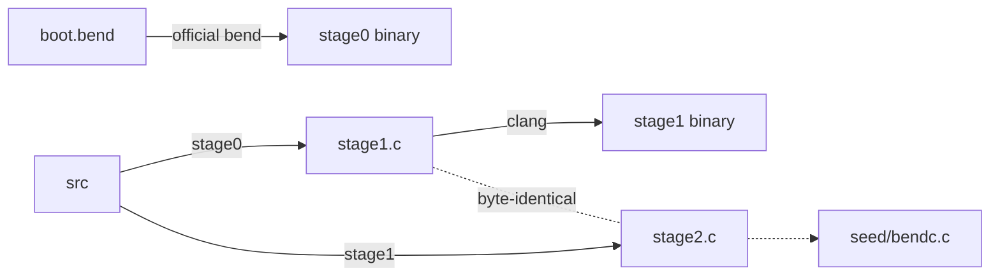

<h1 align="center">bendc</h1>

<p align="center">
  <b>A self-hosting compiler for <a href="https://bend-lang.com">Bend 2</a>, written in Bend 2.</b><br>
  Bend in, C out. The compiler compiles itself, and the output reproduces itself byte for byte.
</p>

<p align="center">
  <a href="https://github.com/Lulzx/bendc/actions/workflows/ci.yml"></a>
  
  
  <a href="LICENSE"></a>
</p>

---

```
$ ./bootstrap.sh
[stage0] bend boot.bend -o build/bendc0           # the official Bend builds bendc once
[stage1] bendc0 -> build/stage1.c                 # bendc compiles itself
[stage2] stage1 -> build/stage2.c                 # the result compiles itself again
fixpoint: stage1.c == stage2.c (44696 lines)
tests with stage1: 80 passed, 0 failed
tests with stage2: 80 passed, 0 failed
```

`bendc.bend` (the compiler) and `check.bend` (the type checker) are Bend: about 22,000 lines that
`bend --check-only` accepts: `check.bend` outright, and `bendc.bend` with exit status 1 since Bend
2.0.32, which lists the 18 defs that rely on foreign code (the package fetcher `Hub.ensure`, which
imports C, and its callers); bendc's checker prints the same report. bendc type-checks
a program the way the official checker does (a port of it, with the same error reports), then lexes, parses, erases, and code-generates it, including the
parts of Bend's standard library (`Base`) that the program uses. The result is a single C file that
clang builds against the runtime (`rt/bendrt.h`): a garbage collector, native `Nat` and arrays, a
work-stealing pool for parallel calls, an event loop that speaks the official effect ABI, and a GPU
backend that runs `f!(x)` calls on Metal.

## Contents

- [Quick start](#quick-start)
- [What it looks like](#what-it-looks-like)
- [Bootstrapping](#bootstrapping)
- [Language support](#language-support)
- [How it works](#how-it-works)
- [The GPU backend](#the-gpu-backend)
- [The native backend](#the-native-backend)
- [Benchmarks](#benchmarks)
- [Writing a compiler under Bend's rules](#writing-a-compiler-under-bends-rules)
- [Testing](#testing)
- [Limitations](#limitations)
- [Repository layout](#repository-layout)

## Quick start

You need a C compiler (clang) and a [Bend install](https://bend-lang.com), which provides `base.bend`:

```sh
curl -fsSL https://bend-lang.com/install.sh | sh    # the official Bend (provides ~/.bend/bend2/base.bend)

git clone https://github.com/Lulzx/bendc && cd bendc
make                  # builds build/bendc from the committed C seed, in about 2 seconds
make test             # compiles and runs every program in tests/, comparing with the official bend
```

Compile a program:

```sh
./build/bendc ~/.bend/bend2/base.bend hello.bend > hello.c
clang -O2 -I rt hello.c -o hello -lm && ./hello
```

`bendc --js <base.bend> file.bend > file.js` emits JavaScript instead (run it with `bun file.js`; see
[The JavaScript target](#the-javascript-target)). `bendc --check-only <base.bend> file.bend` only type-checks, printing what `bend --check-only` prints.
`bendc --no-check ...` compiles without checking. Debugging aids: `bendc --tokens file.bend` prints the
token stream after layout, and `bendc --ast file.bend` prints the parsed declarations.

A compiled program takes the official runtime's options: `--threads N` (default: the CPU count),
`--gpu on|off|SIZE` (`off` runs `f!(x)` calls on the CPU threads), `--bend-help`, and `--` before
the program's own arguments.

## What it looks like

A Bend program:

```python
import Base

type Shape is Data:
  Circle{r: U32}
  Square{s: U32}

def area(x: Shape) -> U32:
  match x:
    case Circle{+r}:
      (3 * r * r : U32)
    case Square{+s}:
      (s * s : U32)

def sum(xs: List<U32>, acc: U32) -> U32:
  match xs:
    case Nil{}:
      acc
    case Con{h, t}:
      sum(t, (acc + h : U32))

def adder(k: U32) -> U32 -> U32:
  x => (x + k : U32)
```

The C that `bendc` generates for it, unedited:

```c
static V F_area(V a0) {
top:;
V s0 = a0;
if (TAG(s0) == 0) {
return F_U32_dmul(F_U32_dmul(3u, FLD(s0, 0)), FLD(s0, 0));
} else if (TAG(s0) == 1) {
return F_U32_dmul(FLD(s0, 0), FLD(s0, 0));
} else { bend_fail("runtime fail-stop"); }
}

static V F_sum(V a0, V a1) {               // the tail call becomes a loop
top:;
V s33 = a0;
if ((s33) == IMM(0)) {
return a1;
} else if (TAG(s33) == 1) {
{ V t0 = FLD(s33, 1); V t1 = F_U32_dadd(a1, FLD(s33, 0)); a0 = t0; a1 = t1; goto top; }
} else { bend_fail("runtime fail-stop"); }
}

static V F_adder(V a0) {                   // lambdas are lifted into closures
top:;
return mk_clo(L35, 2, 1, (V[]){a0});
}
```

A `main` that returns a value, rather than `IO`, is evaluated, and the value is printed in Bend
syntax. This matches the official tool:

```python
def main() -> List<&2, Tree<String>> & Maybe<&2, Box> & Nat & Char & String & Bool:
  ([Node{Leaf{}, "a\n\"b\"", Node{Leaf{}, "c", Leaf{}}}, Leaf{}], Some{Box{3.0}}, 42n, '\'', "tab\there", True{})
```
```
([Node{Leaf{}, "a\n\"b\"", Node{Leaf{}, "c", Leaf{}}}, Leaf{}], Some{Box{3.0}}, 42n, '\'', "tab\there", True{})
```

## Bootstrapping


```mermaid
flowchart LR
    boot[boot.bend] -->|official bend| s0[stage0 binary]
    src -->|stage0| c1[stage1.c]
    c1 -->|clang| s1[stage1 binary]
    src -->|stage1| c2[stage2.c]
    c1 -. byte-identical .- c2
    c2 -.-> seed[seed/bendc.c]
```

- **`make bootstrap`** does the full chain. The official `bend` builds stage0 from `boot.bend`, an
  entry that reaches bendc's C code generator but not its type checker or JavaScript backend (stage0
  only translates `bendc.bend` with `--no-check`). Stage0 compiles `bendc.bend` into `stage1.c`, and
  stage1 compiles it again into `stage2.c`. The two C files must be identical, and stage1 and stage2
  must pass the test suite.
- **Memory.** The official compiler's footprint grows with the code `main` reaches, and it expands a
  `match` on string literals char by char (and a large `Nat` literal level by level), copying the
  other arms into every branch. bendc avoids such patterns, so building stage0 takes about 16 s and
  4 GB (building all of `bendc.bend` would take about 70 s and 10 GB).
- **`seed/bendc.c`** is the committed fixpoint, the way self-hosting compilers usually ship a seed.
  Building `bendc` needs only a C compiler. `make selfcheck` verifies that the current `bendc.bend`
  still compiles to exactly this seed, and `make seed` regenerates it after the compiler changes.
- **`make ddc`** checks the seed by diverse double-compiling ([Wheeler,
  2009](https://dwheeler.com/trusting-trust/)): a 45,000-line generated C file can't be audited
  by reading it, so a compiler that plants something in its own output would survive every
  fixpoint above. `tools/ddc.sh` compiles `bendc.bend` twice, once with a stage0 the official Bend
  translates to C and GCC builds, once with the seed GCC builds. Both outputs must equal
  `seed/bendc.c` byte for byte. The first path shares nothing with the seed (not its C, and not
  clang, which the official `bend -o` calls), so a tampered seed would have to be matched by the
  official Bend and GCC together. It needs GCC 15 or newer (the official C uses `musttail`). On
  arm64 a third leg builds bendc with its own native backend (see [The native
  backend](#the-native-backend)) and checks that it compiles `bendc.bend` to the seed too.
- **`make tcc`** builds the seed with the [Tiny C Compiler](https://repo.or.cz/tinycc.git), which
  [bootstrappable builds](https://bootstrappable.org) reach from a few hundred bytes of hex (through
  M2-Planet and GNU Mes), so bendc can join that chain. The tcc-built bendc must compile `bendc.bend`
  to the seed byte for byte, and the test suite must pass with tcc building the programs and the
  runtime (`tools/tcc.sh`; `TCC=...` picks the binary). It needs tinycc 0.9.28 (the `mob` branch):
  0.9.27 has no `stdatomic.h`. Under tcc the runtime keeps per-thread state in a pthread key (tcc
  has no thread-local storage in Mach-O), `main` runs the constructors itself (tcc ignores
  `__attribute__((constructor))`), and `!`-calls have the simulator and the CPU but not Metal.
- **`make boot`** starts from source instead of a binary or a seed. `boot/` is `bendi`, a Bend
  interpreter written by hand in C99: about 3,800 lines in five files (`parse.c` the lexer, layout,
  parser and module loader; `eval.c` the evaluator; `heap.c` the allocator and a conservative
  mark-sweep collector; `prims.c` the natives, the effects and `main`; `bendi.h`). It reads
  `bendc.bend`, `check.bend`, `core.bend`, `asm.bend`, `rt/*.bend` and `base.bend` as text and runs
  bendc's `main` on them, with types, proofs and erased arguments dropped. `tools/boot.sh` has
  bendi run `bendc --no-check base.bend bendc.bend`, and the C it writes must be `seed/bendc.c`
  byte for byte. So the seed is what `bendc.bend` means as a program, not only what an earlier
  bendc made of it. That takes about 18 s and 1 GB built by clang or GCC, and about 45 s built by
  tcc 0.9.28 on Linux arm64 (`BOOTCC=...` picks the C compiler). bendi trusts only the C compiler
  and libc that build and run it, and `base.bend`. It uses no seed, no official Bend and no
  generated code. Its front end is a port of bendc's own: `bendi --tokens` and `bendi --ast` print
  what `bendc --tokens` and `bendc --ast` print for every source above. Its evaluator follows what
  bendc's code generator relies on: strict evaluation, the natives of bendc's `Natives` list with
  `rt/bendrt.h`'s semantics, the lambda-match and dead-let rules of `LM`, and operators resolved as
  `R.ops` does. It runs the test suite's IO programs too, except those using channels or the clock,
  which it does not implement.

CI runs the whole chain on Linux (arm64) and macOS: seed build, tests, selfcheck, full bootstrap,
`make ddc` (on macOS, with Homebrew's GCC), and `make tcc` and `make boot` (on Linux, with tinycc
built from a pinned commit; `make boot` also with GCC). It
pins the official Bend it tests against (`tools/install-bend.sh`, Bend 2.0.32),
and a weekly run tries the latest release, so a new Bend shows up there before it breaks a push.

## Language support

| Area | Supported |
|---|---|
| Declarations | `type` (with type parameters, `is Data` / `is Type`), `def`, `law`, `@unsafe`, `import Base`, `import ./file.bend as M` |
| Proofs | laws and proofs are accepted and erased at runtime: `{==}`, `{a == b : T}`, `%e : P` rewrites, `?holes`, dependent types |
| Patterns | several scrutinees at once; nested constructors; `h <> t`; tuples; `0n` / `1n+p`; char, number and **string** literals; `_`; `+x` |
| Bindings | `x = v`, `+x = v`, `-x = v`, `(a, b) = v`, `K{..} = v`, parallel lets `a b = f(x) g(y)` |
| Functions | closures, currying and partial application, templates (`~f`), `f!(x)` calls, and tail calls compiled to loops |
| Monads | `do M<..>:` for any monad (`IO`, `Maybe`, `Result`, your own), `x : T <- m`, `return` |
| Operators | `(a + b : T)` typed arithmetic, bitwise and comparison operators, `&&` `\|\|` `++` `<>` |
| Data | `U32`, `Nat`, `F32`, `Char`, `String`, lists, tuples, `Map`, `Set`, arrays (`[v : T*n]`, `a[i]`, `a[i] <- v`) |
| Effects | every Base effect but windows: printing, audio, `IO.args`, `IO.get_env`, files, TCP, UDP, `IO.now`/`sleep`/`random_u32`, concurrent `IO.fork`/`IO.join`/`IO.spawn` and channels, `IO.die` exit codes |
| Foreign code | `def f(..) -> IO(R): import "./f.c"` and `import "./f.js"` effects, written against the official C and JS effect ABIs (Base's own `effs/*.c` and `effs/*.js` are compiled this way) |
| Modules | `import ./file.bend as M`, and hub packages by content hash: `import 0x<hash>/main.bend as P` |
| Parallelism | parallel lets `a b = f(x) g(y)`, written or found by the compiler, run on a work-stealing thread pool; `f!(x)` calls run on the GPU (Metal), parallel lets inside them as GPU tasks |
| Checking | the official type checker, ported: quantities, termination, templates, laws and proofs, dependent types |
| Output | an `IO` main runs its effects; any other main prints its value in Bend syntax |

## How it works

```
source ─► lexer ─► layout ─► parser ─► operator  ─► tables ─► core IR ─► codegen ─► C file ─► clang ─► binary
          chars    INDENT/   (parser    resolution            erasure,    (state          +
          →tokens  DEDENT    monad)                           inlining    monad)       rt/bendrt.h
```

1. **Lexer and layout.** Characters become tokens, and indentation becomes `NEWLINE`/`INDENT`/`DEDENT`.
   A deeper line opens a block only after a `:`. Otherwise it continues the previous line, and so
   does a line after one that ends in an operator. Newlines inside brackets are ignored.
2. **Parser.** Recursive descent, written with a parser monad `Toks -> A & Toks` and Bend's own
   `do`-notation. Statements fold into `let`/`match`/bind expressions, and `do` blocks desugar into
   `M.bind`/`M.pure` calls. Types are terms in Bend, so they parse with the expression grammar;
   `List<a, A>` is recognised by the missing space before `<`, and `>>` is split when it closes one.
3. **Operator resolution.** `(a + b : T)` becomes `T.add(a, b)`, with the type taken from the nearest
   annotation. Unannotated operators belong to `Nat`.
4. **Tables and erasure.** Every constructor gets a tag, an arity and a representation. Every def gets
   a mask of its runtime parameters. Erased parameters (`-x`, bare quantity parameters, and
   `Type`/`Data`/`Kind`-typed ones) are dropped at each known call site. Parameters of a def that
   fills a `law` take their modes from the law.
5. **Core IR.** Each def (but a type-level one, whose body the printers unfold) is lowered to
   [`core.bend`](core.bend)'s IR, where every argument of a call of a global def is marked relevant
   or erased by the callee's mask. The lowering (`Core.Lo.def`) and the raising back to bendc's
   syntax tree (`Core.Up.go`), which the inliner and the optimizer use, are in `core.bend` too, and
   [`LOPROOF.bend`](LOPROOF.bend) proves the laws in [`LO.bend`](LO.bend). Raising a lowered term
   gives the term back (`up_lo`), and a lowered def never fails a variable lookup: each variable
   the lowering emits is bound where it runs (`lo_scoped`), a run of a state whose terms and values
   are scoped that way never gives the failure of a lookup (`scope_ok`), and so neither does a
   run of `main` in a program of lowered defs (`lo_prog`), given natives that give no such failure.
   There is no semantics for the syntax tree (`Expr`), so nothing says that lowering keeps a def's
   meaning; the laws say only that it loses nothing and that its variables are bound.
   `Core.Def.erase` replaces the erased arguments, and the types left
   in runtime positions, with a box. [`PROOF.bend`](PROOF.bend) proves that this preserves the IR's
   semantics, which `core.bend` gives in Bend as a fuelled machine (`Core.run`): the law
   ([`LAWS.bend`](LAWS.bend)) says running a program and erasing the result gives what running the
   erased program gives. Then full calls of a monad's `bind`, `pure`,
   `go` and `go.done` (the parser's, the generator's, the checker's) are inlined. The callee is
   renamed apart, each argument takes its parameter's place when that moves no work into a lambda,
   and the places it lands are reduced: an applied lambda becomes a `let`, and a `let` of a known
   constructor binds its fields. A `do` block becomes one closure, and the
   checker, which runs on these monads, runs 9% fewer instructions. Last, `Core.Def.red` turns
   every lambda applied to one argument, `(p => b)(a)`, into `let p = a; b`, anywhere in the def.
   [`REDPROOF.bend`](REDPROOF.bend) proves the law in [`RED.bend`](RED.bend): if a run does not run
   out of fuel, the reduced program, with as much fuel or more, gives the same result, reduced
   (`red_ok`; `red_prog` for a program's `main`). The let takes fewer steps than the application,
   so the proof shows that more fuel does not change a result that did not run out (`L.mono`), and
   that in one program the application and the let give the same result (`L.beta.law`). Like
   erasure's proof, it assumes that the natives commute with the pass (`ok`); it also assumes that
   a native gives one value or fails (`one`). Then `Core.Def.known` resolves each `match` on a
   known constructor `K{as}`: it drops each case whose pattern is another constructor's, and when
   the first case left is `K`'s with a variable for each field, it makes the match one on `as`
   with that case alone, which bendc compiles as lets (no `K` is built). A field pattern that can
   fail keeps the match, since its case can move on to the next. [`KNOWNPROOF.bend`](KNOWNPROOF.bend)
   proves the law in [`KNOWN.bend`](KNOWN.bend), `known_ok` (and `known_prog`), stated as
   `red_ok` is, with the same assumptions; the resolved match takes no more steps than the source,
   and in one program the two give the same result (`K.mat`). Last, `Core.Def.dead` drops each
   `let` of a variable that no lookup in its body reaches (none, or each one past a nearer binding
   of the name), which makes the generated C of bendc 0.9% smaller.
   [`DEADPROOF.bend`](DEADPROOF.bend) proves the law in [`DEAD.bend`](DEAD.bend). The two programs
   do not give the same values here: a closure made past a dropped let lacks that binding in its
   scope. So `dead_ok` relates states and results instead: values are related when they are the
   same with the pass taken, except that a closure's scope may lack bindings no lookup of its body
   reaches. From related states, with as much fuel or more, the program without dead lets gives a
   related result, unless the source fails (the dropped value may have been the one to fail or
   run out of fuel). `dead_prog` says that when `main`'s result holds no closure (and is not a
   failure), the program without dead lets gives exactly that result with the pass taken. The
   dropped let's steps are the source's alone, so the proof follows the source's fuel and lets the
   other program wait at the let's body. Before dropping dead lets, `Core.Def.lit` puts a number (a
   `U32`, `I32`, `Nat` or `F32` literal) in place of each lookup of a variable let-bound to it,
   unless a nearer binding of the name hides it; the let is then dead.
   [`LITPROOF.bend`](LITPROOF.bend) proves the law in [`LIT.bend`](LIT.bend), `lit_ok` (and
   `lit_prog`), stated as `dead_ok` is (a source that fails is related to anything). A closure made
   past a substituted let keeps the binding in its scope, but its body no longer looks it up, so
   values are related when the pass, run with the lets known at the closure (a list of names, each
   with its number or none), takes one body to the other, and the scope holds those bindings. The
   let is taken as a relation step rather than by running the source ahead.

   Inlining small defs (the optimizer's `i`, below) is `Core.Def.inline`. A call of a def the map
   `ins` holds, with an argument for each parameter, becomes a match on the arguments with one
   case: a variable for each parameter, and the def's body with its own calls inlined, 16 deep.
   The arguments run in the caller's scope, in the order a call runs them. The body runs with the
   parameters bound in front of that scope, as a call binds them. Nothing is renamed, and no
   argument sees a parameter. The body could see a caller's binding behind the parameters, but
   only by looking up a name the parameters do not bind, and the source's lookup of that name
   fails. [`INLINEPROOF.bend`](INLINEPROOF.bend) proves the law in [`INLINE.bend`](INLINE.bend),
   `inline_ok` (and `inline_prog`). It is stated as `lit_ok` is (a source that fails is related to
   anything), with one more assumption, `agree`: the def `ins` holds for a name is the program's
   first def of that name. bendc takes the map's defs from the program, so this holds when def
   names are unique. Scopes are related when the inlined program's holds the source's bindings,
   related, and possibly more. A closure's body is related to the body with the pass taken some
   number of levels deep. The match binds the parameters in one step per parameter, where the
   call binds them in one, so the other program can need more fuel. The proof shows that running
   the arguments took more steps than binding them does, so the other program has the fuel.
   Otherwise the source runs out too. While the source looks up the def, the other program waits
   at the body.

   Substitution (part of the optimizer's `s`, below) is `Core.Def.subst`. For a `let` of a
   variable whose value is an atom (a variable, a literal, a box, a constructor with no fields),
   or which its body looks up once (once outside a lambda, unless the value is a lambda or a
   constructor), it puts the value, with the pass taken, in the place of each lookup of the
   variable that is under no other binding (a lambda's, a case's, or a nearer let's). The let
   stays, and `Core.Def.dead` drops it once no lookup is left. It does so only when no binding of
   the let's scope, a parameter's included, has the variable's name, so the value put in place
   sees what it saw at the let. [`SUBSTPROOF.bend`](SUBSTPROOF.bend) proves the law in
   [`SUBST.bend`](SUBST.bend), `subst_ok` (and `subst_prog`), stated as `lit_ok` is (a source that
   fails is related to anything). The other program may need more fuel or less: the value runs
   where its lookup was, not at the let, so the other program's fuel is found as the steps go
   (the proof puts the fuel of a step's two runs together, and `L.mono` gives more). Scopes are
   related entry by entry with what the pass knows of each binding; a substituted binding's
   entry holds a run of the value, put in place, that gives a related value. A lookup walks the
   scope and the pass's knowledge together. The value is also taken with the let's own binding in
   front, which none of its lookups reach, since the scope has no other binding of the name.

   The proven functions are the ones bendc runs; the inliner no longer resolves matches itself.
   Not proven:
   - the expansion of monadic binds (`Inl`, which renames with a per-depth suffix), and which
     defs count as small;
   - the simplifier `s`: let floating, case of case, the known-case rules, a let sunk into a
     match's cases, the rules for applications, the folding of comparisons, and the substitution
     of atoms and of lets used once where a lookup is under a binding (a lambda's, a case's or a
     let's body), which moves a value across that binding;
   - specialization `p` and fusion `f`, of which `OPT.bend` proves only instances;
   - code generation;
   - that lowering keeps a def's meaning (only the round trip and the scope laws above).

   Both checkers verify the eight proofs in CI.

   Then the optimizer (`Opt` in `bendc.bend`) works on the whole program in the core IR. The
   inlining of monadic binds, `Core.Def.red`, `Core.Def.known`, `Core.Def.lit` and `Core.Def.dead`
   always run first, on every def; the passes below come after, and their own case of a known
   constructor or literal resolves what the proven ones leave (literal patterns, nested patterns,
   matches that inlining exposes).
   `BEND_OPT` names its passes by letter: the default is `i..spuf`, and `BEND_OPT=` turns it off.
   - `i` inlines small defs: a body of size at most 4 plus 2 per `.` (8 for `i..`) that calls only
     defs declared before it (so inlining ends), and is neither native nor `IO`. Most of the gain
     comes from `Bool.pick`, `Bool.and`, `Bool.or` and `Bool.not`, whose arguments move into the
     branches, so only the taken one runs. The inlining is the proven `Core.Def.inline` (above);
     the choice of defs is not proven.
   - `s` simplifies each body bottom up. A dead let goes. A let of an atom, or one used once outside
     a lambda, takes its variable's place: the proven `Core.Def.subst` (above) where no lookup is
     under a binding, and the walk's own rule otherwise. The walk runs three times, each followed
     by `Core.Def.subst` and `Core.Def.dead`, and the next walk reduces where values landed; the
     two run once more after `p` and `f`. The proven pass leaves a let alone when a binding of its
     scope has the variable's name (inlined bodies reuse names), which the walk's own rule could
     substitute; this costs a few lets in some tests, and none in the benchmarks. A small let over a match that reads it only in its cases
     goes into them. A match on a known constructor or literal takes the first case whose patterns
     match, and stops at one that may not. Lets float out of matches and applications. A match on
     a match whose cases all end in constructors goes into those cases (case of case), when the
     copies are small. An applied lambda becomes a let. Parallel lets stay parallel. A comparison
     of literals folds, and a comparison of a match whose cases give literals goes into the cases
     (`U32.is_zero(b2u(c))` is a match on `c`). In a match on several values, a value that is a
     literal or a constructor without fields is dropped from the match, with the cases it cannot
     match, when every case's pattern for it is known to match it or not. `k+` of a `Nat` literal
     folds.
   - `p` specializes a higher-order def. A call that passes a closed function (a lambda with no
     free variables, as every `~f` template argument is, or a def's name) for a parameter the
     callee passes unchanged to its own calls calls a copy instead. In the copy the function takes
     the parameter's place and is simplified, and its self-calls drop the argument. Copies are
     shared by the callee's name and a hash of the function's text.
   - `u` unrolls calls with literal arguments. A call that passes a `Nat` literal up to 64 that the
     callee's body matches on, or a constructor without fields that the body matches on first,
     calls a copy with the literal in the parameter's place, simplified. In the copy the match on it is resolved, and its call for
     the predecessor passes a literal again, so a count of `n` becomes `n + 1` copies, each a
     straight line. Only small bodies are copied: at most 300, and at most 1100 / (n + 1) for a
     count of `n`. The copies are shared by name and argument as `p`'s are. raytrace's scan of 9
     spheres and merkle's 22 rounds unroll, and the constants they read become literals; a loop
     of 64 does not.
   - `f` fuses a consumer with a producer. Take a call `g(.., p(..), ..)` where `g` is recursive
     and matches on that argument alone, and some result of `p` is a constructor with a field that
     calls `p` (`p` builds a list or tree). It calls a fused def instead: `p`'s body with `g`
     around each result, `g` unfolded where the result is a constructor, and each
     `g(.., p(..), ..)` left over made a call of the fused def. The structure `p` built is never
     built. `sum(filter(xs))`, `foldr(map(map(xs)))` and `length(map(xs))` become single loops.
     Fused defs that nothing calls are dropped.

   [`OPT.bend`](OPT.bend) states these rewrites as laws on the instances the optimizer meets
   (map/map, foldr/map, foldl/map, length/map, a fused consumer, a specialized copy, case of case,
   a folded comparison) and proves each by induction. Both checkers verify it in CI. These are laws
   about instances, not a proof that these passes on `Core.Tm` preserve meaning, as REDPROOF and
   KNOWNPROOF are for theirs.

   Instructions (single thread) with each pass added, bendc building itself and checking itself:
   none 12.3G / 26.1G; `i..` 9.2G / 20.7G; `i..s` 9.3G / 20.1G; `i..sp` 8.0G / 20.1G;
   `i..spf` 8.0G / 20.1G. Its C grows 2.6%. (With the native backend in bendc, all passes take
   the build from 14.6G to 9.1G and the check from 36.9G to 28.3G; its C grows 3%.) The native
   backend starts from the same optimized defs: `bench/pipe.bend` runs 4.9G instructions without
   the passes, 3.2G with them. On `bench/pipe.bend` the passes take 47.9G to 8.2G
   (specialization to 19.7G, fusion the rest). On the official benchmarks the instruction counts
   stay within 1%, except kmeans, where inlining small defs into a loop with many live values
   makes clang spill: 12% more instructions, about 5% more time.
6. **Code generation.** A state monad threads fresh names, emitted C, references and errors through
   the generator. Only defs reachable from `main` are emitted.
   - Each def becomes a C function, and self tail calls become `goto` loops.
   - Defs that build their result around a tail call (`x <> merge(xt, ys)`) are compiled
     destination-passing: see [Benchmarks](#benchmarks).
   - Lambdas are lambda-lifted using free-variable analysis.
   - A call with every argument goes direct; with fewer it builds a partial closure; with more it
     goes through `apply`.
   - A match becomes a first-match `if` chain over tags. A `match` or `let` in expression position
     uses a GNU statement expression.
   - A `U32` lives in a `uint32_t` C local: a def's `U32` parameters, a let whose value is a
     `U32`, and a statement expression whose results are. The runtime's `U32` natives take
     `uint32_t` operands, so clang compares and computes in 32 bits. Passed as 64-bit words, the
     values were widened, and kmeans's loop vectorized in 64-bit lanes: 77G instructions, now 60G.
7. **Value printers.** For a non-`IO` main, printers are generated from main's return type and the
   field types of each constructor, specialised per type instance (e.g. `Tree<String>`).

**Runtime** (`rt/bendrt.h`, about 520 lines). Every value is one 64-bit word:

| Value | Representation |
|---|---|
| `U32`, `Char`, `F32` | the raw number (`F32` as IEEE bits) |
| `Nat` | the raw number, at most 2^48 - 1 (as in the official runtime; past it is an error) |
| `Array<T>` | pointer to a flat block of 2^depth cells, written in place (a shared array is one block) |
| nullary constructor (`Nil{}`, `True{}`) | `(tag << 3) \| 1` |
| constructor with fields | pointer to `{tag, fields...}` |
| one constructor with one field (`Chr{code}`) | the field itself |
| closure | pointer to `{fn, arity, nargs, args...}` |

Base implements `U32` as a 32-bit vector of `Bool`s, which proofs can reason about. `bendc` replaces
those defs, and the `Nat`/`F32`/`Array` primitives, with native C; `Nat` arithmetic stops with an
error past 2^48 - 1, where the official runtime does. Memory is managed by a conservative mark-sweep collector: the threads that run
Bend code are stopped with a signal while it marks their stacks. The program runs on a thread with a
4 GB stack, so deep non-tail recursion is fine: a million-deep recursive list builds and folds in about
0.1s, where the official runtime overflows its stack at 100,000.

A parallel let forks every value but the last onto a Chase-Lev work-stealing deque and joins them in
reverse; a fork nobody stole runs inline, so fine-grained recursion stays cheap (`pow2!(26n)` from the
guide takes 0.70s on one thread, 0.15s on eight).

Parallel lets are also found. Bend is pure, so the operands of one node (an operator's, a call's
arguments, a constructor's fields) may run in any order. Where two or more of them call back into
the def, as in `fib(n - 1) + fib(n - 2)` or `merge(msort(a), msort(b))`, `bendc` turns them into a
parallel let, and the fork depth above keeps the small calls cheap. An argument the callee erases or
never reads stays where it is.

The pass also looks at blocks: a def's body, a case's, or a lambda's, which is a chain of lets and
the expression they end in. In a block, a call is heavy when it calls a def (not a native) that
recurses, or a def that forks. The pass collects the heavy calls that no let of the block feeds.
It puts them into one parallel let, placed where the most of them can move: the top of the block,
or just after the last let that one of them reads. So `a = f(l)`, `b = f(r)`, `g(a, b)` forks
`f(l)` and `f(r)`. A def that is not recursive itself but calls such defs, such as one that adds
the four quadrant products of a matrix product, forks too.

Some calls always stay where they are:

- a call under a lambda or in a match's cases;
- a value of a parallel let the program wrote;
- a call that ends the block, so that a loop's tail call stays a jump.

Only whether a call recurses or forks makes it heavy, not its size. The cutoff is the fork depth:
past the frontier, a parallel let runs its values in order.

The pass is on by default and `BEND_AUTO_PAR=0` turns it off. With `BEND_NO_FREE=1` it defaults
to off (`BEND_AUTO_PAR=1` turns it back on). A compiler's tree walks are small and called often.
With the pass on, bendc builds itself to the same C, but in 1.75s where it takes 0.85s with the
pass off. `fib 44` runs 4.5x faster on 12 cores, and `sort` in [Benchmarks](#benchmarks) 2.4x.

Each of the 16 official benchmark programs writes its parallelism out, as parallel lets. To test
the pass, each parallel let `a b = x y` in them was rewritten as the lets `a = x` and `b = y`,
40 in all. On the rewritten programs, bendc forks at as many places as on the programs as written,
and the PAR times match the originals within the noise of a shared machine (load 12 to 22). The
pass before blocks already recovered the batch trees: the optimizer inlines a let that is used
once into its use, which gives an operator or a call with two recursive operands. The block rule
recovers the rest. These are merkle's `audit` and `pgen`, and tree-matmul's `add4`, `vadd2` and
four-way `cksum`. On the programs as written, the pass also
forks symreg's `esize` and a second let in tree-matmul's `round`.

IO follows Base's continuation-passing `IO` type. An effect call becomes a request node that an event
loop answers, as in the official runtime: computations run their pure code up to their next effect,
`IO.fork` computations run concurrently, blocking work parks, and a deadlock is reported. Effects use the
official ABI (`Term`, `Env`, `IoWork`, `io_eff`, `CID_*`), so the `.c` files that effect defs import,
Base's own `effs/*.c` included, are spliced into the output unchanged.

## The GPU backend

A `f!(x)` call hands the call, and every parallel let inside it, to the GPU. `bendc` compiles every
function the call can reach into one kernel, a flat state machine: each function is a set of blocks
(a call ends a block, and the callee returns to the next one), locals live in frame slots, and `pc`
names the block to run. A parallel let pushes its values as tasks to a lock-free queue and continues
through a join record, so no lane ever waits: the lane that brings a join its last value runs the
rest of the function. Past a fork depth that fills the lanes, parallel lets run in order. A def that
only matches, binds, builds constructors, calls natives and other such defs, and calls itself in tail
position is *flat*: it becomes a plain device function with its locals in registers and a loop for its
tail calls.

Below the fork depth, a def that is flat but for its parallel lets and calls to itself becomes
`KQ_name`: its parallel lets run in order, its locals stay in registers, and a call to itself saves
only the variables used after it, with a resume label, on a small thread-private stack (a tail call is
a jump). The lanes of a SIMD group run in lockstep, so a lane that entered such a call alone would
hold its 31 neighbours up for the whole subtree; instead a lane waits at the call until each lane of
its group waits too or has nothing to do, and they run their calls together. Calls of looping flat
defs are gathered the same way. A 2^30-leaf fork tree runs in 0.14s on an M4 Pro's GPU, against
0.24s for the official runtime (see [Benchmarks](#benchmarks)).

The kernel's text (`rt/gpu.h` plus the generated blocks) compiles both as Metal Shading Language and
as C. The host (`rt/gpuhost.h`) reaches Metal through the Objective-C runtime and asks the linker
for Metal itself, so programs need no extra link flags. The first run of a program keeps its
compiled kernels in `~/Library/Caches/bend` (see [Benchmarks](#benchmarks)). Memory is unified: the
device reads the arguments where they are in the CPU heap, builds new objects in an arena, and the
host copies the result back into the heap. Anything the
device cannot do (an effect, a `Nat` past 2^63, a full arena, a closure made by a CPU lambda) stops
the device, and the call runs on the CPU instead, so a `!` never changes what a program prints.

```sh
BEND_GPU_LOG=1 ./prog       # say where each !-call ran
BEND_GPU=sim ./prog         # run the kernel in its C form, lanes interleaved (any OS)
./prog --gpu off            # !-calls on the CPU threads
```

`BEND_GPU_LANES` (default 8192), `BEND_GPU_MB` (arena size) and `BEND_GPU_FORK` (fork depth, default
log2 of the lanes plus 2) tune the device.
Without Metal (Linux), `!` runs on the CPU threads, as the official runtime does without a GPU.

## The JavaScript target

`bendc --js` emits one JavaScript file: the runtime (`rt/bendrt.js`, embedded in bendc through
`rt/rtjs.bend`), the `.js` files the program's effects import, and the program. Values are what the
official JS target uses, so JS effects written for it run unchanged: a `U32` or `F32` is a number, a
`Nat` a `BigInt`, a `Bool` a boolean, a `Char` a one-code-point string, a `String` a string, and any
other constructor an object `{$: "Name", field: value}`. Functions are curried JS functions, and self
tail calls become loops. Effects are requests answered by an event loop with the official helpers
(`io_done`, `io_fail`, `io_tup`, `io_park_on`, `io_sys`, ...); the ones that make system calls use
`bun:ffi`, so run the output with Bun. Parallel lets run one value after the other.

## The native backend

`bendc --native -o prog base.bend prog.bend` compiles a program to AArch64 machine code without a C
compiler seeing it. The code generator (the "Native code generation" section of `bendc.bend`) and
the assembler and object writer ([`asm.bend`](asm.bend)) are Bend. bendc encodes the instructions,
lays out the code, resolves its labels, and writes the relocatable object itself: Mach-O on macOS,
ELF on Linux (`Cc.elf` asks the host which). The system linker then links it with the runtime.

- **What still goes through `cc`.** The runtime (`build/bendrt.o`, compiled once), `rt/native.c`
  (external names for the runtime's inline natives, compiled once as `natives.o`), and the C of the
  program's effects (their sources from Base's `effs/*.c`, with the ids they use), which bendc
  writes next to the object. `cc` also links them.
- **Same runtime, same ABI.** The code starts from the same lowered defs as the C generator and keeps
  the runtime's value representation (see [How it works](#how-it-works)) and AAPCS64, so it calls
  the runtime's functions (`apply`, `str_cache`, the allocator, the effect loop) as C does.
- **Code shape.** Every value lives in a frame slot and an expression leaves its value in `x0`.
  The first 10 slots are the callee-saved registers `x19`..`x28`, so a def's parameters and its
  longest-lived values stay in registers across calls; the collector scans registers as it scans
  the stack. A def with at most 8 kept parameters takes them in `x0`..`x7`;
  a wider one takes the address of a row of arguments. A self tail call moves the new arguments
  over the parameters and branches back, and a tail call to another narrow def pops the frame and
  branches. Integer, `U32` and `F32` natives are inlined (`add`, compares, shifts, `fadd`, `fmul`,
  `fcmp`, `ucvtf`, ...; by a constant, one instruction); the others call their `N_` name in
  `rt/native.c`. A peephole pass turns a reload right after a store to the same slot into a
  register move. String literals are cached in data slots, and float literals are constants.
- **Registers.** After code generation, a pass (`N.ra`) computes which of `x19`..`x28` are live
  at each instruction of a function, and gives each register a new one: `x11`..`x15` for a value
  never live across a call, else the first of `x19`.. that does not interfere. The prologue saves
  only the pairs used. A second pass (`N.pp`) drops moves and writes nobody reads, and forwards a
  move into the instruction after it. A function whose body does not use `sp` gets a smaller frame.
- **Shrink-wrapping.** A path from a function's entry to a return or a tail call that calls
  nothing and stores nothing (as `forks`'s `case 0n`) is copied before the prologue, with its
  callee-saved registers renamed to free scratch ones; any branch off the path goes to the full
  function.
- **Allocation.** A node of 2 to 6 words is allocated inline: the code finds the thread's
  allocation caches from `sp` (the runtime maps each Bend thread's stack at a multiple of 4 GiB
  and keeps the thread's record in the first word), and takes the slot at the cache's bump
  pointer, or the lowest free bit of its bitmap word, as the C backend's inlined `gc_alloc_x`
  does. It calls `bn_alloc2`.. only when the cache is empty. The layout this relies on is written
  down in `rt/native.c` and checked there with `_Static_assert`.
- **As the C backend does.** Matches free the nodes they open (`bend_take`, `bend_share`;
  `BEND_NO_FREE=1` turns it off). Parallel lets fork on the runtime's pool (`par_fork`,
  `par_join`), with a sequential clone for a def that stops forking below a depth. A def like
  `merge`, that builds a constructor around a call to its group, stores its result through a
  destination pointer and loops, with the node's hole written as `BEND_HOLE` until it is filled.
  `x * k + b`, for a power-of-two literal `k`, is one `fmadd` when the product is a normal float.
- **Float registers.** Nested `F32` operations compute in FP registers with no trip through the
  integer registers. A def that calls itself in tail position keeps its `F32` parameters (of its
  first four) in `s8`..`s11` as well as in their slots, so a float loop like `leaves`' reads and
  writes them in place.
- **Coverage.** All 33 programs in `tests/` pass with `--native` on macOS (arm64) and on Linux
  (arm64, in Docker), and `run_tests.sh` runs them there. bendc compiles itself with `--native`:
  the native bendc prints the same C for `bendc.bend` as the C build, and the object it writes for
  itself is the one the C build writes, byte for byte. `tools/ddc.sh` has this as a third leg: the
  seed, built by GCC, compiles `bendc.bend` natively, and that bendc compiles `bendc.bend` to
  `seed/bendc.c`.

What it does not do, against the C backend:

- `!`-calls run on the CPU.
- No inlining of defs into one another.
- AArch64 only. The target is picked by the host, so there is no cross-compiling.

With tcc (`tools/tcc.sh`), the chain has no clang or GCC in it: tcc builds the runtime and
`natives.o`, and bendc writes the program's machine code.

Against the C backend (clang `-O2`), interleaved runs, best of 9 (5 for the check), on an Apple
M4 Pro that was running other jobs at the time (load average between 8 and 21), so only the ratios
mean much, and those move by about 0.1 from run to run:

| program | C backend | native | native / C |
|---|---|---|---|
| `forks 24` | 0.0079s | 0.0077s | 0.99 |
| `forks 24` (1 thread) | 0.0286s | 0.0297s | 1.04 |
| `leaves 12` | 0.936s | 1.078s | 1.15 |
| `leaves 12` (1 thread) | 6.27s | 7.23s | 1.15 |
| `sort 1000000` | 0.163s | 0.191s | 1.17 |
| `sort 1000000` (1 thread) | 0.460s | 0.495s | 1.08 |
| bendc compiling `bendc.bend` to C | 2.13s | 2.55s | 1.20 |
| bendc checking `bendc.bend` | 1.95s | 2.54s | 1.30 |

On one thread, `forks`, `leaves` and `sort` are within 1.2 of the C backend, and bendc compiling
itself is 1.2. Building is where it wins: `bendc --native` builds bendc (check, code
generation, assembly, link) in 3.5s, where `bendc -o` takes 20s, most of it clang compiling
59,000 lines of C.

## Benchmarks

### The official runtime benchmarks

`bench/official.sh` runs the 16 programs of the official repository's `bench/runtime` the way
upstream's `gates/perf.ts` runs them. The official build is `bend main.bend -o main.c`, compiled
with `cc -std=c11 -O3` (and Metal for the GPU). bendc's build is `bendc -o`. Each binary runs in
three modes: SEQ is `--threads 1 --gpu off`, PAR is `--threads 8 --gpu off` (8 is the largest
power of two under the 12 cores), and GPU is `--gpu SIZE`. The outputs of all builds must agree.
`--rc` adds bendc's reference-counting build (`BEND_RC=1`) as the `rc` columns.

The machine was an Apple M4 Pro (12 cores, 24 GB, macOS 27), with official bend 2.0.32. It was
shared with other jobs, and the load average stayed between 9 and 12 during the run. The runs of
the three builds were interleaved, and each figure is the best of 3 runs, with its peak memory.
The fastest build in each mode is in bold.

Rows marked `*` were measured again after the change to the array functions described below.
The load was between 8 and 11 for this second run, which did not include the `rc` build. The `rc`
columns of these rows come from the first run.

| program | SEQ bendc | SEQ `rc` | SEQ official | PAR bendc | PAR `rc` | PAR official | GPU bendc | GPU `rc` | GPU official |
|---|---|---|---|---|---|---|---|---|---|
| bfs * | 7.930s 305M | 29.466s 6.2M | **3.944s 2.3M** | 1.408s 326M | 7.358s 8.3M | **0.549s 2.6M** | 1.330s 347M | 6.650s 16.8M | **0.404s 13.8M** |
| editdist * | 3.393s 278M | 82.770s 6.2M | **2.233s 2.3M** | 0.514s 281M | 17.327s 8.6M | **0.337s 2.8M** | 0.555s 290M | 14.862s 17.1M | **0.328s 13.6M** |
| gameoflife | 8.361s 6.0M | **8.121s 6.0M** | 8.919s 2.4M | **1.167s 8.5M** | 1.211s 7.2M | 1.252s 2.6M | 0.124s 13.3M | 0.125s 13.2M | **0.069s 13.8M** |
| hashmap * | **1.687s 267M** | 2.714s 6.5M | 2.979s 2.7M | **0.277s 277M** | 0.580s 11.3M | 0.424s 5.8M | **0.298s 288M** | 0.529s 21.3M | 0.632s 13.7M |
| kmeans * | 3.697s 6.1M | 3.731s 6.2M | **2.173s 21.1M** | 0.572s 13.5M | 0.728s 9.1M | **0.366s 21.0M** | 1.141s 26.9M | 1.323s 18.5M | **0.271s 14.2M** |
| lexer * | 3.527s 6.0M | 8.407s 6.1M | **2.348s 2.2M** | 0.593s 127M | 1.975s 7.7M | **0.354s 2.7M** | **0.810s 176M** | 2.266s 16.2M | 2.174s 13.8M |
| mandelbrot | 5.468s 6.0M | 5.433s 6.0M | **5.108s 2.5M** | 0.677s 15.4M | 0.707s 7.4M | **0.639s 2.8M** | 0.081s 13.4M | 0.080s 13.3M | **0.054s 13.8M** |
| merkle | 5.684s 229M | 5.725s 201M | **4.839s 130M** | 0.923s 270M | 0.864s 202M | **0.708s 131M** | 0.482s 806M | 0.545s 806M | **0.070s 13.9M** |
| nbody | **5.799s 6.1M** | 6.010s 6.1M | 6.706s 2.4M | **0.720s 8.0M** | 0.862s 7.8M | 0.933s 2.6M | 0.072s 13.3M | 0.072s 13.2M | **0.060s 13.7M** |
| queens | 8.864s 6.0M | 8.238s 6.0M | **5.969s 2.3M** | 1.521s 270M | 1.336s 7.2M | **0.907s 2.5M** | 1.716s 282M | **1.504s 15.4M** | 1.659s 13.7M |
| raytrace | 8.027s 6.0M | 9.081s 6.0M | **5.074s 2.3M** | 1.323s 6.7M | 1.622s 7.1M | **0.839s 2.6M** | 6.209s 15.0M | 6.406s 15.5M | **0.319s 13.8M** |
| symreg | 4.467s 260M | 8.435s 6.1M | **3.359s 2.3M** | 0.687s 270M | 1.463s 9.1M | **0.547s 2.7M** | 7.691s 13.9M | 7.946s 14.0M | **0.437s 13.8M** |
| terrain * | 3.085s 213M | 75.964s 6.1M | **2.260s 2.4M** | 0.489s 227M | 14.861s 8.2M | **0.310s 3.0M** | 0.503s 241M | 12.649s 16.4M | **0.183s 13.8M** |
| tree-bitonic | 46.838s 408M | 35.602s 405M | **7.054s 147M** | 11.717s 427M | 7.621s 407M | **1.605s 153M** | 11.455s 432M | 8.066s 416M | **0.766s 13.9M** |
| tree-matmul | 10.673s 268M | 13.004s 8.4M | **2.322s 3.0M** | 2.584s 287M | 2.620s 25.7M | **0.557s 8.8M** | 2.463s 306M | 2.449s 46.2M | **0.380s 14.3M** |
| tree-radix | 4.702s 510M | **4.153s 569M** | 5.008s 652M | 2.560s 883M | 2.133s 898M | **0.733s 646M** | 4.576s 1005M | 3.144s 1065M | **0.632s 14.1M** |

bendc is fastest in 10 of the 48 program and mode pairs:

- SEQ: gameoflife (`rc`), hashmap, nbody and tree-radix (`rc`).
- PAR: gameoflife, hashmap and nbody.
- GPU: hashmap, lexer and queens (`rc`).

In the other 38 pairs, the official build is fastest. None of bendc's wins come from parallelism
the program does not write. When this table was measured, the automatic parallelism pass (see
[How it works](#how-it-works)) changed the generated C for only one of the 16 programs, symreg,
and symreg is slower than the official build in every mode. All 16 programs write their
parallelism out. With it removed, the pass finds it again (see How it works).

Where bendc loses, and why:

- **bfs.** bendc executes about 86G instructions, where the official build executes 26G. The
  loop's result is a pair of a state record and a `Bool`. bendc allocates that pair on every pop,
  while the official build flattens it into six outputs. The official build also stores `U32`
  array cells as 32-bit words. Doing the same in bendc means extending its unboxing to nested
  records, which is not done.
- **editdist.** Every array access loads the array's header to find the mask, and every value
  used twice is checked before it is shared. Two runtime changes helped:
  - `bend_share` now tests for a plain word before it loads the heap bounds. This cut editdist
    from 121G instructions to 91G. The official build executes 48G.
  - `Array.get`, `Array.set` and `Array.swap` are now always inlined under clang. `bendc -o`
    links the runtime as a separate object, and in that build clang had stopped inlining
    `Array.set` into editdist's loop. A binary from `bendc -o` took 4.3s, where the same C
    compiled as one unit took 2.9s. With the change, both take 2.9s.
- **kmeans.** The inner loop is vectorized, in 32-bit lanes as in the official build (see
  [How it works](#how-it-works), code generation). Most of the remaining time goes to the zip of
  the chunk lists (`S_szip`, a quarter of the samples).
- **terrain.** `bendc -o` links the runtime as a separate object, and there `arr_new` was a call,
  so clang did not know a new array's size and masked every index with a mask loaded from the
  array. `arr_new` is now inline: 57G instructions, now 51G (the official build: 45G). The traced
  `bend_dead` then added 19G back (70G). Unboxing splits `fill`'s and `hist`'s
  `Array<U32> & U32` parameter into two, and the unused `U32` half had only its field's type
  variable, so each loop step called `bend_dead` on it. A parameter's type now keeps the heads of
  its arguments (`&<Array,U32>`), and a field whose type is a parameter of its type gets a scalar
  argument's type. The half is then a `uint32_t` and needs no `bend_dead`: 53G.
- **lexer.** The program allocates a mode node (`InId{h}`) and a string cell for every character.
  The official build appears to store a constructor with a single field without allocating a
  node. Either that representation or in-place reuse would remove the allocations.
- **tree-bitonic and tree-matmul.** Most of the time goes to allocating and freeing each tree
  node. The reference-counting work (in-place reuse) addresses this cost.
- **GPU.** raytrace and symreg run their GPU mode 15 to 20 times slower than the official build.
  merkle, terrain and tree-radix run it 3 to 7 times slower. bendc hands a `!`-called def to the
  GPU only when the def fits the device kernel (see [The GPU backend](#the-gpu-backend)). The
  rest runs on the CPU.
- **`rc` mode.** On editdist and terrain, the `rc` build is about 25 times slower than the
  default in SEQ. On bfs it is 4 times slower. All three programs read cells out of large arrays in a
  loop, and in `rc` mode each read takes a reference. In exchange, `rc` uses far less memory
  than the default on every program except merkle and the tree programs.

Before this round, the same script gave these bendc times, with the load between 10 and 16:

| program | SEQ | PAR | GPU |
|---|---|---|---|
| bfs | 8.78s | 3.72s | 4.18s |
| editdist | 3.66s | 1.03s | 0.99s |
| kmeans | 8.20s | 1.77s | 2.88s |
| tree-bitonic | 47.0s | 16.9s | 15.6s |
| tree-radix | 4.52s | 3.44s | 4.28s |

### Programs in `bench/`

`bench/run.sh` builds each program in [`bench/`](bench) with bendc (`bendc -o`) and with the official
`bend` (2.0.25, `bend -o`), checks that both print the same thing, and reports the best of three runs
with its peak memory. Sizes come from the command line, so neither compiler can compute the answer at
compile time. On an Apple M4 Pro (12 cores, 24 GB, macOS 27):

| program | what it does | bendc | official bend | bendc memory | official memory |
|---|---|---|---|---|---|
| `forks 28` | a parallel let at every level of a 2^28-leaf tree, CPU threads | **0.06s** | 0.12s | 2.8 MB | 2.7 MB |
| `forks_gpu 28` | the same as a `!`-call, on the GPU | **0.07s** | 0.13s | **13.0 MB** | 13.3 MB |
| `leaves 14` | 16384 leaves of a 200,000-step `F32` loop, CPU threads | **0.68s** | 1.02s | 2.8 MB | 2.7 MB |
| `leaves_gpu 14` | the same as a `!`-call, on the GPU | **0.05s** | 0.10s | **13.1 MB** | 13.2 MB |
| `leaves_gpu 16` | the same with 65536 leaves | **0.08s** | 0.15s | 13.1 MB | 13.1 MB |
| `sort 1000000` | build, merge sort and sum a million `U32`s (allocation-heavy; bendc sorts the halves in parallel, see [How it works](#how-it-works)) | **0.14s** | 1.10s | 72.9 MB | **32.4 MB** |

| task | bendc | official bend |
|---|---|---|
| build `forks.bend` (source to binary) | **0.19s** | 0.31s |
| build `forks_gpu.bend` | **0.32s** | 0.55s |
| build `leaves.bend` | **0.19s** | 0.30s |
| build `leaves_gpu.bend` | **0.31s** | 0.55s |
| build `sort.bend` | **0.21s** | 0.32s |
| type-check `bendc.bend` (16,000 lines with `check.bend`) | 1.30s, **590 MB** | **0.77s**, 840 MB |
| build `bendc.bend` into a binary | **8.1s** | 70s, 9.9 GB |

Where the time goes:

- **Forks on the CPU.** A def that is flat but for its parallel lets and calls to itself gets a
  sequential clone, `S_name`. Each thread tracks its fork depth; past log2(threads) + 6 levels a
  parallel let runs its values in order through the clone: no closures, deque pushes or joins.
- **Forks and loops on the GPU.** See [The GPU backend](#the-gpu-backend): seq defs and looping flat
  defs run in their own small kernel (`bend_kq`), a whole SIMD group at a time. A `Nat` is a
  plain word, so a `1n+p` match is one compare. With a bignum check in it, `iter`'s loop was no
  longer a counted loop to Metal, and ran 2.4x slower.
- **Implicit forks.** `msort(a)` and `msort(b)`, the arguments of one `merge`, become a parallel
  let (see [How it works](#how-it-works)): `sort` takes 0.14s where it took 0.33s on one thread,
  for 73 MB where it took 30 (the halves are live at once).
- **Float loops on the CPU.** `iter`'s step, `x * x * 0.5 + c`, is a chain of three float operations,
  each waiting on the last. `bendc` emits `a * k + b` with a literal `k` as `F32_mulk_add`, one
  `fma` when `k` is a power of two and `a * k` a normal float: the product is then exact, so the
  `fma`'s one rounding is the add's, and the result the same to the bit. The chain is two operations,
  and `leaves` 17% faster; any other case branches to the two operations as written.
- **Builds.** The runtime is compiled once (`build/bendrt.o`, from `rt/bendrt_impl.c`), so a program
  compiles only its own code; bendc's own front end takes about 0.1s for these programs.
- **Building lists.** `merge` returns `x <> merge(xt, ys)`: a cell around a call. Such defs (a group
  of defs that tail-call one another, with such a cell on the cycle) get a `D_name(dst, ..)` function
  that stores its result through `dst`: it allocates the cell with a hole, stores it, points `dst`
  at the hole and jumps to the next call. That jump is `goto top` for the def itself, and a call
  marked `musttail` for another def of the group (the group's `D_` functions share one signature).
  `sort` builds its lists in a loop instead of a million-deep recursion.
- **Checking.** Declarations are checked in parallel on the CPU threads, against the book as it stands
  before each; the allocator hands out partly free blocks by their bitmaps; `Map.bit` is native.

**Memory.** Bend values are affine: a value has one owner unless it went through a variable used
more than once. So, as in the official runtime (which counts references), a `match` that opens a
node frees it, and `sort` stays near one list's size: 30 MB where the collector alone needed 481 MB.

- A value bound to a variable that some path uses twice is marked shared where it is bound
  (`bend_share`): a bit in the node's tag word. Cached string literals are shared too.
- A match reads the node's fields, then hands it to `bend_take`: a shared node stays and marks its
  fields shared (once: a second bit says it did); any other is dead, and its slot goes back to its
  block's allocation bitmap.
- A block where a fifth of the slots are free again is a reuse candidate. A thread's next
  allocations of that size take its free slots in address order, blocks in address order, so a list
  built from reused slots stays in order in memory, which keeps list walks fast.
- The tracing collector still runs; freed slots only make it rarer.

A compiler's heap is mostly shared, short-lived data, where freeing costs more than it saves:
bendc builds itself with `BEND_NO_FREE=1`, which compiles matches without it (as do `make
selfcheck`, `tools/reseed.sh` and `bootstrap.sh`). `-DBEND_DEBUG_FREE` builds a program whose
freed nodes are poisoned and kept, so a use after free stops with the C line that freed it.

**Reference counting (`BEND_RC=1`).** A program compiled with `BEND_RC=1` counts references
instead, in the manner of Perceus (Reinking et al., PLDI 2021), and the tracing collector never
runs: there are no pauses, and memory goes back as soon as the last reference to it is dropped.
The mode is off by default: see below for where it wins and where it loses. `bendc --native`
does not implement it: native programs are traced whatever `BEND_RC` says.

- The count sits in bits 48 to 61 of an object's first word, above the tag, the closure's
  function or the array's header. The count is of the references past the first, so a new
  object, whose first word is written whole, has one reference. Bit 62 makes an object immortal,
  and its count is never changed again: a cached string literal, or an object whose count
  reached 2^14.
- The code generator relies on Bend's affine types. Each use of a variable consumes a
  reference. A variable that a path uses n times gets n - 1 more references where it is bound
  (`rc_dupn`). A variable that path does not use is dropped there (`rc_drop`). A `match` arm
  drops what it uses less than the arm that uses it most. `_` patterns, lambda captures,
  parallel-let values and array leaves follow the same rule. Arguments that a call erases
  (types and `~` parameters) are not counted.
- A match that opens a node hands it to `rc_take`. A node with one reference is freed, and its
  fields move to the pattern's variables. A shared node gives each field a reference and then
  loses one.
- **Reuse.** When an arm builds a constructor of the same size as a node it opened, the node's
  slot is kept (`rc_take_ru`) and the constructor is written into it (`CR1`..`CRN`). If the node
  was shared there is no slot, and the constructor allocates. An arm that builds nothing frees
  the slot. Reuse is not applied to the arguments of a def's call to itself in tail position
  (a loop): an accumulator built in the nodes the loop walks ends up scattered, as a sort's
  halves do.
- **Borrowing.** A def may borrow a parameter: the caller keeps its reference (and drops it
  after the call if it owned it), and the def neither takes the nodes it opens in it nor drops
  it. A parameter is borrowed when the def only matches it and passes it, or what it reads out
  of it, to defs that borrow there; a value read out of it and used otherwise gets a reference
  where it is bound. A def that does that stays borrowing only when it walks down the value in a
  tail call to itself (a search); any other owns the parameter, so that its nodes can be reused
  (`List.map`). Parameters of defs with parallel lets, destination-passing groups, `main` and
  `!`-called defs are never borrowed. `String.eq`, `String.cmp`, `Map.get` and `Map.has` are
  native and borrow too: they walk the value and hand it back unchanged.
- **Constants.** A constructor whose fields are all literals is built once, on first use, and
  kept as an immortal object (`KONST`).
- **Threads.** Bit 63 marks an object that other threads may reach, and only a marked object's
  count changes atomically. A count of one is read plainly, because whoever holds the only
  reference is the only thread that can see it. A task that another thread takes has its
  closure marked first, along with everything the closure reaches (`rc_publish`). That
  includes what sits below nodes with one reference, since the forking thread may hold those
  objects too. Marking stops at objects that are already marked, because everything a marked
  object reaches is marked. A forked task waits in its deque unmarked (`P_HELD`). A thief that
  finds one asks the owner, which marks the task and lets it go at its next fork or join, so
  only the tasks that are actually stolen pay for marking. Allocation bits are set with an
  atomic OR, since another thread may free a slot of the same block. Values are acyclic, so dropping the last reference frees everything the value reaches;
  `rc_free_obj` does this iteratively, on a per-thread stack.
- **The runtime.** Closures, arrays (`Array.get` gives the cell a reference), string literals,
  IO requests, channels (a sent value's reference moves to the receiver, and a send to a closed
  channel drops the value), parallel lets (a fork's closure owns its captures) and GPU copy-back
  (the result takes references to the CPU objects it reaches, and a device run drops its
  arguments) all follow the same counts.
- **The collector.** The minor collector, the rescans for destination-passing holes and the
  signal that stops threads for a collection are not used. The block allocator and its bitmaps
  are shared with the traced mode: a freed slot clears its bit, and the block becomes a reuse
  candidate.
- **Deciding what is a reference.** A word is a reference when it is above 2^32, 8-aligned,
  inside the heap, at the start of a slot, and that slot's allocation bit is set. The one mistake
  this allows is a `Nat` whose value equals the address of a live object.
- **Checking it.** `BEND_RC_STATS=1` prints the number of objects still live at exit.
  `-DBEND_DEBUG_FREE` poisons freed objects and never reuses them, so a use after free is
  caught. `run_tests.sh` builds every test a second time in this mode (`rc/NAME`).
  `tests/rcstress.bend` runs 320 rounds of parallel lets that share a string and a list, with a
  1 MB heap. `tools/rcstress.sh [runs]` runs the multithreaded tests (`rcstress`, `par`,
  `fork`, `chan`, `stress`, `dps`, `gc`) 300 times each with a 1 MB heap.

Measured on the same machine while other jobs were running on it. Each figure is the best of 3
runs (5 for the builds, 9 for `sort` on one thread), with the runs of the variants interleaved;
peak memory is shown in parentheses. `default` is this compiler's usual output, which uses the
collector; `rc` is the same compiler with `BEND_RC=1`. The four `bench/runtime` programs are
the official repository's; `official` is `bend -o`, version 2.0.32.

| program | threads | default | `rc` | official | longest pause, default |
|---|---|---|---|---|---|
| `sort 1000000` | 1 | **0.31s** (61 MB) | 0.32s (**30 MB**) | 0.83s (32 MB) | none |
| `sort 1000000` | all | **0.12s** (73 MB) | 0.13s (**31 MB**) | 0.74s (32 MB) | none |
| merkle | 1 | 5.22s (229 MB) | 5.28s (201 MB) | **4.77s** (**134 MB**) | none |
| merkle | 12 | 0.96s (272 MB) | 0.86s (202 MB) | **0.84s** (**134 MB**) | 105 ms |
| tree-radix | 1 | 4.90s (682 MB) | **4.12s** (**565 MB**) | 4.84s (655 MB) | 451 ms |
| tree-radix | 12 | 4.82s (1223 MB) | 1.18s (1001 MB) | **0.86s** (**583 MB**) | 883 ms |
| tree-bitonic | 1 | 47.6s (662 MB) | 32.4s (404 MB) | **7.0s** (**151 MB**) | 627 ms |
| tree-bitonic | 8 | 51.5s (1155 MB) | 17.4s (411 MB) | **1.45s** (**157 MB**) | |
| hashmap | 1 | **2.66s** (266 MB) | 3.10s (**6 MB**) | 3.52s (**6 MB**) | 2 ms |
| hashmap | 12 | 0.60s (295 MB) | **0.55s** (13 MB) | 0.56s (**11 MB**) | 10 ms |
| bendc building itself | 1 | **0.81s** (387 MB) | 1.11s (**236 MB**) | | 22 ms |
| `bendc --check-only bendc.bend` | 1 | **1.39s** (523 MB) | 2.06s (**205 MB**) | | 26 ms |

The tree-bitonic, hashmap and bendc rows were measured again after borrowing, with the load
between 18 and 36. bendc itself is larger now than when the other rows were measured. The pause
column was not measured again.

In `rc` mode the collector never runs, so there are no pauses at all. The mode wins where the
collector has a lot of live data to trace: tree-radix and tree-bitonic, and parallel tree-radix
most of all. It loses where a program walks shared data without keeping it. Opening a shared
node costs a reference for each of its fields, plus the release of the node itself. `hashmap`
spends its time in `rc_take_shared` walking chains that `Array.get` shares, and the compiler
does the same with its maps and environments. Borrowed parameters remove part of this cost:
what remains is mostly in the checker's own maps and in nodes that are opened and rebuilt, which
cannot be borrowed.

On 8 threads, `rc` runs tree-bitonic in a third of `default`'s time, but still 12 times slower
than the official build: most of what remains is allocating and freeing each node. The
`default` column is no slower than the compiler
before reference counting went in, within the noise of these runs. `String.cmp` and
`String.eq` are native: they walk both strings and return them unchanged, where Base's
versions rebuild both. This change applies to both modes, and it cut bendc's own build from
0.78s to 0.51s.

On the GPU, most of the memory is Metal's: making the device alone costs about 6 MB. The rest is
kept down three ways:

- Metal is linked with the program (weakly, through a `.linker_option` in `rt/gpuhost.h`), which
  the loader maps for about 3 MB less than opening it at the first `!`-call.
- The first run keeps Metal's binary archive of the kernels in `~/Library/Caches/bend`, named by a
  hash of the device code; later runs load the library and the pipelines from it, for 1 MB where
  compiling costs 2.5 (an archive for another GPU or OS misses, and the kernels compile again).
  The first run, which compiles, peaks near 16 MB.
- Pages the GPU writes and the CPU never reads are not counted: the host reads the lanes' `pc`s after
  each dispatch, so a lane's state is stored word by word across all lanes (the `pc`s take 64 KB,
  not the 1.5 MB of every lane's state), and the queue, whose slots keep their sequence numbers
  less their index, starts empty on fresh zero pages.

Filling a hole writes into a cell after it was made, which the collector otherwise never sees: a
minor collection skips the fields of old cells. A hole holds `BEND_HOLE` until it is filled (and a
D_ node's tag word holds it from before its slot is allocated until its fields are stored), so a
collection records the objects a thread's stack or registers point to that hold `BEND_HOLE`, and
the next minor collection rescans them.

## Writing a compiler under Bend's rules

Bend 2 is a proof language, and its checker is strict about code that runs. It shaped this compiler:

- **Define before use, no mutual recursion.** A parser is mutually recursive by nature. Bend allows
  forward declaration through a `law` (a typed claim) that a later `def` fills, but a def that calls
  a law before it is filled must be `@unsafe`. So each cycle of defs is one def instead: an extra
  argument, a selector, says which of the old defs runs, and its constructors carry that def's
  arguments. The return type is a type-level function of the selector (`P.go(fuel, k: PsSel) ->
  Parser(PsSel.ty(k))`), and the old names stay as one-line wrappers.
- **`match` only on parameters.** A match cannot inspect a computed value, and neither can
  destructuring. So each decision is a small helper def whose parameter is the thing being matched.
  The parser monad avoids most of the tuple-destructuring helpers a hand-threaded token list would
  need. After a match, the parameters and fields before the matched one cannot be matched: a proof
  that needs the fuel's shape deep in a case (as `REDPROOF.bend`'s redex does) takes it from a
  separate lemma.
- **Affine variables.** A variable is used at most once unless it is marked `+`, which requires a
  copyable `Data` type. Every AST type is `Data`, and `+` appears where values are reused.
- **Totality.** A recursive call must shrink its first changing argument. Walks over a node and a
  list of nodes recurse on the list's head, then on the node rebuilt with the list's tail (the same
  constructor with a smaller field counts as smaller). Recursion that shrinks nothing (a parser's
  over tokens, a selector-merged cycle, the checker's evaluation of normalized terms) counts down a
  `Nat` fuel argument that starts at `Fuel.max()`, about 4 billion, and fails loudly if it ever
  runs out. A branch on a computed value that recurses is `Bool.pick(T, c, u => a, u => b)(x)`:
  the termination check sees the self-call under the lambda, and bendc compiles it as a match, with
  no closures. Neither `bendc.bend` nor `check.bend` has an `@unsafe` def: the checker's parser
  normalizes each def's value and prints terms in its errors, so the evaluator and the printer
  (`higher`, `term_lower`, `term_show` and what they use) come before the parser's declarations
  (`tools/unsafe_min.py` keeps the markers minimal: it strips them all and puts back one for each
  def the checker rejects).

The compiler compiles every one of these patterns in its own source. It handles its own laws, its
own dependent selectors, and its own user-defined monads (`Parser`, `Gen`), which is what makes the
fixpoint meaningful.

## Testing

`tests/` holds programs covering the features above: closures, trees, maps, sorting, strings and
UTF-8, file IO, concurrent fork/join, TCP, user-defined C effects, modules, string patterns, arrays,
proofs, value printing, exit codes, deep recursion, parallel lets, the collector, reference counting under threads, destination-passing,
and the `Nat` bound.
Each `.out` file is the stdout and exit code of the **official** `bend` running the same program.
`run_tests.sh` compiles each program with a given `bendc`, runs it, and diffs the result; programs
with `!`-calls run again on the GPU simulator and, on a Mac, on Metal, and must not fall back to the
CPU. On arm64 (macOS or Linux) every program runs again through `bendc --native`. Every program
is also built with `BEND_RC=1` and run again (`rc/NAME`; set `BEND_TEST_RC=0` to skip these
runs). A `tests/NAME.env` file sets environment variables for a run (`dps` collects every megabyte, so
collections happen while holes are open);
`tests/hub/run.sh` serves a package from a local hub and imports it by hash.
`tests/check/` holds programs the checker rejects; each `.out` is the official
`bend --check-only` report and exit code, with the repository's path spelled `<repo>` (a missing
import is named by its absolute path).

```sh
make test                      # with build/bendc
./run_tests.sh build/stage1    # with any stage
```

The official repository's own tests are a second, larger suite. `tools/upstream.py` runs every one
that imports Base, has a `main` and expects output (not an error) through a given `bendc`, and
compares the result with the test's `#|` lines as the official gate does. The failures go to
`build/upstream/fails.txt`. Against Bend 2.0.32, all 799 pass in C and 818 of 820 in JavaScript;
the rest are the limitations below. With `--check`, the tests whose check fails
(`#|SOME PROOFS FAIL`) run through `bendc --check-only` instead, which must print the same error
report: all 493 do.

```sh
git clone --depth 1 -b v2.0.32 https://github.com/bendlang/bend /tmp/bendup
python3 tools/upstream.py build/bendc /tmp/bendup           # C
python3 tools/upstream.py build/bendc /tmp/bendup --js io_  # JavaScript, tests whose name has io_
python3 tools/upstream.py build/bendc /tmp/bendup --check   # the checker's error reports
```

## Limitations

- The native backend (`--native`) is AArch64 only and runs `!`-calls on the CPU (see [The native
  backend](#the-native-backend)).
- The GPU backend targets Metal only; elsewhere `f!(x)` runs on the CPU threads (or on the
  simulator, with `BEND_GPU=sim`).
- No windowing effects (Base's `Window`).
- On JavaScript, a TCP send to a peer that does not read blocks the event loop, and a `select` a
  signal interrupts is not restarted (`io_tcp_send_slow_peer`, `io_select_eintr`).
- A main whose type is `Type` or a type family is printed by normalizing it at compile time, as the
  official interpreter does. A field whose type is a type-level match on a runtime value prints as
  the one inhabited type its arms can give (`LE(r, 1n)` is `Unit` when its other arm is `Empty`),
  and as `?` when there are several.
- Blocks still follow indentation, with the official parser's readings for the layouts it takes
  without reading layout: a `do` statement shallower than its head, and a `case` arm deeper than
  the arm before it.

## Repository layout

| Path | |
|---|---|
| [`check.bend`](check.bend) | the type checker, a port of the official one: parser, normalizer, conversion, quantities, termination, templates, error reports |
| [`asm.bend`](asm.bend) | the native backend's AArch64 assembler, peephole pass, and Mach-O and ELF object writers |
| [`rt/native.c`](rt/native.c) | external names for the runtime's inline natives, which native code calls |
| [`bendc.bend`](bendc.bend) | the compiler, organized by section: lexer, layout, parser monad, expressions, patterns, statements, declarations, operator resolution, free variables, global tables, code generation, value printers, modules, driver |
| [`core.bend`](core.bend) | the core IR between the front end and code generation: terms with relevance-marked arguments, erasure, a semantics, the proven passes, and the lowering from bendc's syntax tree and the raising back |
| [`LAWS.bend`](LAWS.bend), [`PROOF.bend`](PROOF.bend) | the law that erasure preserves the core IR's semantics, and its proof (induction on the fuel, one case per step) |
| [`RED.bend`](RED.bend), [`REDPROOF.bend`](REDPROOF.bend) | the law that reducing applied lambdas to lets (`Core.Def.red`) preserves the core IR's semantics, and its proof |
| [`KNOWN.bend`](KNOWN.bend), [`KNOWNPROOF.bend`](KNOWNPROOF.bend) | the law that resolving matches on known constructors (`Core.Def.known`) preserves the core IR's semantics, and its proof |
| [`DEAD.bend`](DEAD.bend), [`DEADPROOF.bend`](DEADPROOF.bend) | the law that dropping dead lets (`Core.Def.dead`) gives related results (equal ones without closures), and its proof |
| [`LIT.bend`](LIT.bend), [`LITPROOF.bend`](LITPROOF.bend) | the law that putting let-bound numbers in place of their lookups (`Core.Def.lit`) gives related results (equal ones without closures), and its proof |
| [`INLINE.bend`](INLINE.bend), [`INLINEPROOF.bend`](INLINEPROOF.bend) | the law that inlining calls of global defs (`Core.Def.inline`) gives related results (equal ones without closures), and its proof |
| [`SUBST.bend`](SUBST.bend), [`SUBSTPROOF.bend`](SUBSTPROOF.bend) | the law that substituting atoms and lets used once (`Core.Def.subst`) gives related results (equal ones without closures), and its proof |
| [`LO.bend`](LO.bend), [`LOPROOF.bend`](LOPROOF.bend) | the laws of the lowering to the core IR (`Core.Lo`) and the raising back (`Core.Up`): the round trip, and that a lowered def never fails a variable lookup; and their proof |
| [`rt/bendrt.h`](rt/bendrt.h) | C runtime: garbage collector, closures, strings, arrays, native `Nat`, `U32`/`F32`, fork-join pool, event loop and effect ABI, entry points |
| [`rt/gpu.h`](rt/gpu.h), [`rt/gpuhost.h`](rt/gpuhost.h) | the GPU kernel's runtime (one text for Metal and C) and its host: arena, Metal through the Objective-C runtime, the kernel cache, the simulator, copying results back |
| [`rt/hub.c`](rt/hub.c) | bendc's own effect for fetching hub packages (curl and SHA-256) |
| [`rt/chan.c`](rt/chan.c) | the channel effects, spliced for Base's `effs/chan.c` (whose own channel rows the collector would not see) |
| [`seed/bendc.c`](seed/bendc.c) | the fixpoint C output of `bendc.bend`, for building without Bend |
| [`bench/`](bench) | benchmark programs and `run.sh`, which times them against the official `bend` |
| [`tests/`](tests) | test programs and the official `bend`'s output for each |
| [`bootstrap.sh`](bootstrap.sh), [`run_tests.sh`](run_tests.sh), [`Makefile`](Makefile) | bootstrap and fixpoint check, test runner, build entry points |
| [`tools/ddc.sh`](tools/ddc.sh) | diverse double-compiling: the seed, reproduced by two toolchains that share no C compiler, and by bendc's native build |
| [`tools/tcc.sh`](tools/tcc.sh) | the seed built by tcc reproduces itself, and the tests pass with tcc |
| [`boot/`](boot), [`tools/boot.sh`](tools/boot.sh) | `bendi`, a Bend interpreter in C99, and the check that it runs `bendc.bend` on itself to the seed |
| [`tools/unsafe_min.py`](tools/unsafe_min.py) | dev tool: drops the `@unsafe` markers the checker does not need |
| [`tools/order.py`](tools/order.py) | dev tool: section-aware dependency sort, with automatic `law` forward declarations for cycles |
| [`tools/upstream.py`](tools/upstream.py) | dev tool: runs the official repository's tests through a `bendc` (see [Testing](#testing)) |
| [`tools/embed.py`](tools/embed.py) | dev tool: embeds `rt/bendrt.js`, `rt/chan.c` and `rt/gpu.h` (`rt/rtjs.bend`, `rt/rtchan.bend`, `rt/gpu_src.h`) |

## License

[MIT](LICENSE)
